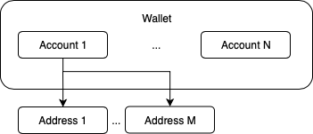

# solarisBank Digital Assets Platform API Guide

An API platform that provides a managed custody solution for storing digital assets.

* Version: [0.6.0]
* Updated: [2019-07-23]

## Introduction

The solarisBank Digital Assets Platform API is designed to allow partners to store digital asset funds on the platform, accept deposits, process withdrawals and keep track of balances in digital assets.

The partner can own a collection of Wallets on our platform, where each Wallet holds the funds owned by the partner for some specific digital asset. There are two types of Wallets:

* Segregated Wallet
* Pooled Wallet

### Segregated Wallet

All the funds in the Wallet belong to Entity, which represents end customer or the partner themselves. On top of the Wallet an Account needs to be created.

The partner can create many Addresses associated with an Account, which can be used to deposit funds there.

The partner can initiate Withdrawals to an external address, within the existing Account balance.

### Pooled Wallet

All the funds in the Wallet are treated as a single pool and there is no separation on the Wallet level between balances of individual customers.

The partner controls and can register Entities on our platform, which represent end customers or the partner themselves as Account holders.

On top of the Wallet there can be many Accounts created, each Account associated with a registered Entity.

The partner can create Addresses associated with an Account, which can be used to deposit funds there.

The partner can initiate Withdrawals to an external address or Transfers to a different Account from an Account on behalf of the Account holder, within the existing Account balance.

> At the moment we create a single Pooled Wallet per partner, only for Bitcoin (BTC) funds. However API is designed to provide similar workflow to all other digital assets when supported by the platform.



## Setup

Before a partner can use the solarisBank Digital Assets Platform API we register them in our system. This happens completely on our side and is not exposed by API endpoints.

During this process we are going to create a Wallet for the partner, a partner Entity, and an Account owned by the partner Entity in the created Wallet.

The next step is to create a key pair that is going to be used by the partner to access the API. This happens on partner side, then the partner sends us the public key part. At no point the solarisBank Digital Assets Platform platform learns the corresponding private key.

Private key is using on the partners side for signing every API request and public key is used on solarisBank API side to verify the ownership and integrity of the request. We will provide additional instructions on how to generate key pairs combined with authentication code examples as separate document guide.

Finally we register the public key received from the partner, after which the partner can access the API.

## Authentication

We require our partners to generate a pair of private & public keys.
Partners MUST register the public key with the Platform and sign every request to our API
using their private key.

We are using *HTTP Signatures* IETF draft as the base for our authentication mechanism.
As the digital signature algorithm in HTTP Signatures we are using *Ed25519*.

Every HTTP request to the API MUST have following headers in addition to
standard ones:

* Digest
* X-Nonce
* Signature

### Digest Header

The `Digest` header ensures integrity of the HTTP request body. It MUST be constructed
following the HTTP Instance Digests RFC using SHA-256 algorithm.

In case of GET request, the `Digest` header still must be constructed, assuming the request
body is an empty string.

See:

* Instance Digests in HTTP <https://tools.ietf.org/html/rfc3230>
* Additional Hash Algorithms for HTTP Instance Digests <https://tools.ietf.org/html/rfc5843>

Example:
```
Digest: SHA-256=X48E9qOokqqrvdts8nOJRJN3OWDUoyWxBf7kbu9DBPE=
```

### X-Nonce Header

The `X-Nonce` header is supposed to uniquely identify the HTTP request
and serves to protect against replay/playback attacks.
The `X-Nonce` header value MUST be a string of up to 32 characters,
which MUST be  unique across all the requests generated using the same
API key.

As an example, `X-Nonce` header value may be generated as 16-bytes
random integer in hexadecimal representation.

Example:
```
X-Nonce: 514bdd41b15f6b1a0443f8c673adc9db
```

### Signature Header

Signature Header string is used to provide authentication and integrity assurances
without the need for shared secrets. It also does not require an additional round-trip
in order to authenticate the client and allows the integrity of a message to be verified
independently of the transport.

Signature Parameters:

* **keyId**

  Unique ID which is assigned to the Partner's API key.

* **algorithm**

  The value for the `algorithm` parameter MUST be `"hs2019"`.

* **created**

  The value of the `created` parameter MUST be the time at which
  the HTTP request was constructed as an integer Unix timestamp.

* **headers**

  The `headers` parameter identifies how the canonical Signature String is constructed.
  Its value consists of a list of actual and pseudo- HTTP headers which will form
  the Signature String according to the HTTP Signatures draft v11.

  The `headers` parameter MUST include following
  headers: `(request-target)`, `(created)`, `digest`, `x-nonce`.

  The recommended value of the `headers` parameter is:
  `(request-target) (created) digest x-nonce`.

  See:

  * Signature String Construction
    <https://tools.ietf.org/html/draft-cavage-http-signatures-11#section-2.3>

  Example of Signature String for `headers="(request-target) (created) digest x-nonce"`:

  ```

  (request-target): get /foo?bar=123\n
  (created): 1557855475\n
  digest: SHA-256=47DEQpj8HBSa+/TImW+5JCeuQeRkm5NMpJWZG3hSuFU=\n
  x-nonce: 7c44d38b63f5e398af62d603b1155f5c

  ```

  Here `\n` indicate the ASCII newline character. Note the absence of it on the last line.

* **signature**

  The value of the `signature` parameter is the digital signature of the HTTP request produced
  by the partner's private key.

  In order to create the `signature` parameter:

  * Construct the canonical Signature String according to the value of the `headers` parameter
  * Using the private key that corresponds to the provided `keyId` generate an Ed25519
    signature of the Signature String obtained on a previous step
  * Base64-encode the signature

### Examples

```
POST /foo/bar
Digest: SHA-256=X48E9qOokqqrvdts8nOJRJN3OWDUoyWxBf7kbu9DBPE=
X-Nonce: 514bdd41b15f6b1a0443f8c673adc9db
Signature: keyId="foobar",algorithm="hs2019",created=1557855475,headers="(request-target) (created) digest x-nonce",signature="IKGyxGiUFm3luudWGkTzf0TYQD2Fnkb6ed6BTfuXuDq/U9q6gQk6KxBSPx33ME1O2RLlH5HKG2WZnO8PgRGiDA=="

{"hello": "world"}
```

```
GET /foo?bar=123
Digest: SHA-256=47DEQpj8HBSa+/TImW+5JCeuQeRkm5NMpJWZG3hSuFU=
X-Nonce: 7c44d38b63f5e398af62d603b1155f5c
Signature: keyId="foobar",algorithm="hs2019",created=1557855475,headers="(request-target) (created) digest x-nonce",signature="d0Wzjlpt2Y++DJtxKnD1ipkkwF5eU43jwtybqsy3tFqa5P3kYYIJa4TTQyMUZ62i58jwN7gK6q2MVJBDGQ6tDg=="
```

See:

* HTTP Signatures, <https://tools.ietf.org/html/draft-cavage-http-signatures-11>
* Ed25519, <https://ed25519.cr.yp.to/>


## IDs

All resources exposed by the API have uniform unique ID scheme, which follows the scheme of solarisBank API — an ID is a String of 36 characters.

### Example

```
{
  "person_id": "5b1c711ef5cf4b7012b688616ed052d3cper"
}
```

## Assets

An Asset in our system represents a single digital asset of some kind. This can be a cryptocurrency (e.g. Bitcoin), a token (ERC20) or some other type of asset.

Any Asset has an artificial unique identifier and some additional details. For example, an ISO currency code equivalent, a human readable description, and other individual properties of an asset like the amounts precision or the address validation rules.

The Asset identifiers are the only way to refer a specific asset on our platform. Any other forms of reference, like an ISO code, are not considered immutable and/or unique.

The API provides a way to list all Assets supported by the platform:

See:

```
GET /v1/assets
GET /v1/assets/{asset_id}
```

### Example

```
GET /v1/assets/00000000000000000000000000000001asst
```

```
200 OK

{
  "id": "00000000000000000000000000000001asst",
  "code": "BTC",
  "precision": 8,
  "description": "Bitcoin",
  "created_at": "2019-01-17T17:05:44Z"
  "updated_at": "2019-01-17T17:05:44Z"
}
```

## Wallets

The API provides a way to list all the Wallets owned by the partner or to fetch an individual Wallet's details.

Since the Wallets are created outside of the API interaction, the partner can list all available Wallets to learn the individual Wallet IDs.

See:

```
GET /v1/wallets
GET /v1/wallets/{wallet_id}
```

### Example

```
GET /v1/wallets/82b46f5310d8a35fb4755cc13fddd681walt
```

```
200 OK

{
  "id": "82b46f5310d8a35fb4755cc13fddd681walt",
  "asset_id": "00000000000000000000000000000001asst",
  "balance": "123.45670000",
  "created_at": "2019-03-17T09:38:04Z",
  "updated_at": "2019-04-02T12:27:33Z"
}
```

## Entities

During the setup phase we only create one Entity of type `PARTNER`,  which represents the partner as an Account holder.

To be able to create Accounts on behalf of end customers, the partner MUST beforehand create corresponding Entities of type `PERSON`. During this process the partner MUST provide a `person_id` — a unique identifier of an individual provided by solarisBank KYC product.

See:

```
POST /v1/entities
GET /v1/entities
GET /v1/entities/{entity_id}
```

### Example

```
POST /v1/entities

{
  "person_id": "5b1c711ef5cf4b7012b688616ed052d3cper"
}
```

```
201 Created

{
  "id": "10ef67dc895d6c19c273b1ffba0c1692enty",
  "type": "PERSON",
  "person_id": "5b1c711ef5cf4b7012b688616ed052d3cper",
  "created_at": "2019-04-02T12:27:33Z",
  "updated_at": "2019-04-02T12:27:33Z"
}
```

## Accounts

An Account represents an aggregation of funds attributed to some registered Entity as an Account holder. It can be an end customer or the partner owning an Account. The association between the Account and its owner is permanent.

To create an Account, the partner MUST provide a reference to an existing Entity and the Wallet.


### Account Balance

The Account resource provided by the API contains the `balance` attribute, which represents the Account Balance. Accounts start with having a balance of 0.

Every successfully processed Transaction increases or decreases the Account Balance
by creating corresponding Ledger Entries. As such the Account Balance equals to the sum of all Ledger Entries of this Account.

See:

```
POST /v1/entities/{entity_id}/accounts
GET /v1/entities/{entity_id}/accounts
GET /v1/entities/{entity_id}/accounts/{account_id}
```

### Example

```
POST /v1/entities/10ef67dc895d6c19c273b1ffba0c1692enty/accounts

{
  "wallet_id": "82b46f5310d8a35fb4755cc13fddd681walt"
}
```

```
201 Created

{
  "id": "9c41ec8a82fb99b57cb5078ae0a8b569acct",
  "wallet_id": "82b46f5310d8a35fb4755cc13fddd681walt",
  "entity_id": "10ef67dc895d6c19c273b1ffba0c1692enty",
  "balance": "0.00000000",
  "created_at": "2019-02-02T13:41:34Z",
  "updated_at": "2019-02-02T13:41:34Z"
}
```

## Addresses

An Address represents a blockchain-level digital asset address associated with an Account. This Address can be used to make deposits to the Account.

There can be many Addresses created and associated with an Account, and once created the Addresses stay permanently valid and permanently associated with the Account. This is how we track the ownership of funds deposited to some blockchain-level address.

See:

```
POST /v1/entities/{entity_id}/accounts/{account_id}/addresses
GET /v1/entities/{entity_id}/accounts/{account_id}/addresses
GET /v1/entities/{entity_id}/accounts/{account_id}/addresses/{address_id}
```

### Example

```
POST /v1/entities/10ef67dc895d6c19c273b1ffba0c1692enty/accounts/9c41ec8a82fb99b57cb5078ae0a8b569acct/addresses

{}
```

```
201 Created

{
  "id": "42049cb01a6962d0232223e632aac68baddr",
  "account_id": "9c41ec8a82fb99b57cb5078ae0a8b569acct",
  "address": "1F1tAaz5x1HUXrCNLbtMDqcw6o5GNn4xqX",
  "created_at": "2019-02-02T13:43:34Z",
  "updated_at": "2019-02-02T13:43:34Z"
}
```

## Transactions

A Transaction represents an operation that affected the balance of the Account.

Transactions have a `type` attribute, which describes the operation:

* DEPOSIT
* WITHDRAWAL
* TRANSFER

In addition Transaction have following attributes:

| name                | type    | desc                                          |
|---------------------|---------|-----------------------------------------------|
| account_id          | String  | ID of the account tx belongs to               |
| state               | String  | State of the tx, e.g. "PENDING"               |
| amount              | Decimal | Transacted amount, positive or negative       |
| fee_amount          | Decimal | Charged fee, always positive or 0             |
| total_amount        | Decimal | Credited/debited amount, positive or negative |

`total_amount` indicates by how much the account balance have changed. It always equals `amount - fee_amount`.

See:

```
GET /v1/entities/{entity_id}/accounts/{account_id}/transactions
GET /v1/entities/{entity_id}/accounts/{account_id}/transactions/{transaction_id}
```

### Example

```
GET /v1/entities/10ef67dc895d6c19c273b1ffba0c1692enty/accounts/9c41ec8a82fb99b57cb5078ae0a8b569acct/transactions
```

```
200 OK

{
  "items": [
    {
      "id": "bf20c716075ea82a4b1f3f0b49657161atrx",
      "account_id": "9c41ec8a82fb99b57cb5078ae0a8b569acct",
      "type": "DEPOSIT",
      "state": "PENDING",
      "amount": "1.12340000",
      "fee_amount": "0.00000000",
      "total_amount": "1.12340000",
      "created_at": "2019-04-02T13:15:47Z",
      "updated_at": "2019-04-02T13:15:47Z"
    },
    {
      "id": "4368fe9ac68c3215b2432a6acffddee8atrx",
      "account_id": "9c41ec8a82fb99b57cb5078ae0a8b569acct",
      "type": "WITHDRAWAL",
      "state": "COMPLETED",
      "amount": "-0.80000000",
      "fee_amount": "0.12340000",
      "total_amount": "-0.92340000",
      "reference": "unique-a8e530db9b0e3ba8-blah",
      "created_at": "2019-04-02T13:18:51Z",
      "updated_at": "2019-04-02T13:18:51Z"
    },
    {
      "id": "27341700f516438c28632e8d973a6c59atrx",
      "account_id": "9c41ec8a82fb99b57cb5078ae0a8b569acct",
      "type": "TRANSFER",
      "state": "COMPLETED",
      "amount": "-0.50000000",
      "fee_amount": "0.00000000",
      "total_amount": "-0.50000000",
      "reference": "example of reference",
      "sender_account_id": "9c41ec8a82fb99b57cb5078ae0a8b569acct",
      "receiver_account_id": "f0cfb103e6c3d4a37c2750a1256862a3acct",
      "created_at": "2019-04-02T13:18:51Z",
      "updated_at": "2019-04-02T13:18:51Z"
    }
  ]
}
```

## Deposits

A Deposit is a Transaction of type DEPOSIT. A Deposit represents a single incoming blockchain-level transfer to some Account Address.

Whenever a blockchain transaction is made to one of the addresses created using the API, the sequence is following:

* The transaction is first detected on the network and is registered on the platform as a new Transaction of type DEPOSIT
* The partner can then see the Deposit in the list of Account Transactions and start tracking its state
* The transaction is confirmed by the network and the corresponding Transaction of type DEPOSIT state is changed on the platform, crediting the funds
* The partner can detect the state change by polling for the individual Transaction details or by listing the Account Transactions

### Example

```
GET /v1/entities/10ef67dc895d6c19c273b1ffba0c1692enty/accounts/9c41ec8a82fb99b57cb5078ae0a8b569acct/transactions/bf20c716075ea82a4b1f3f0b49657161atrx
```

```
200 OK

{
  "id": "bf20c716075ea82a4b1f3f0b49657161atrx",
  "account_id": "9c41ec8a82fb99b57cb5078ae0a8b569acct",
  "type": "DEPOSIT",
  "state": "PENDING",
  "amount": "1.12340000",
  "fee_amount": "0.00000000",
  "total_amount": "1.12340000",
  "created_at": "2019-04-02T13:15:47Z",
  "updated_at": "2019-04-02T13:15:47Z"
}
```

## Withdrawals

A Withdrawal is a Transaction of type WITHDRAWAL. A Withdrawal represents a single transfer of funds from an Account to some external blockchain-level address.

### Withdrawal Fee Model

During a Withdrawal processing the platform charges the Withdrawal Fee on the originating Account on behalf of the partner and credits the amount to the partner Entity Account. The Withdrawal Fee charged here is completely configurable by the partner (or can be waived by the partner altogether).

Depending on the underlying blockchain, the platform can batch multiple Withdrawals together and broadcast them in a single blockchain transaction. For the transactions happening on the blockchain-level the platform charges the full network fees amount on the partner Entity Account.

### Processing a Withdrawal

To issue a Withdrawal on behalf of the customer, the partner creates a new Withdrawal object and provides a `reference` value, which MUST be unique across all Withdrawals of this partner and serves as idempotency key.

The Withdrawal is then registered on the platform and validated, triggering an out-of-band MFA process.

Once Withdrawal is validated and approved, the platform proceeds to creating corresponding Account Transactions, and then queues the Withdrawal for processing.

Periodically multiple Withdrawals from the same Wallet are grouped together in a single blockchain-level transaction, which is signed and eventually broadcasted. At this moment the platform creates a corresponding Transaction that charges the processing fee, which  matches the network fees, on the partner Entity Account.

Withdrawals are NOT going to be processed if the partner Entity Account cannot pay the processing fees.

See:

```
POST /v1/entities/{entity_id}/accounts/{account_id}/transactions/withdrawal
```

### Example

```
POST /v1/entities/10ef67dc895d6c19c273b1ffba0c1692enty/accounts/9c41ec8a82fb99b57cb5078ae0a8b569acct/transactions/withdrawal

{
  "reference": "unique-a8e530db9b0e3ba8-blah",
  "address": "3D2oetdNuZUqQHPJmcMDDHYoqkyNVsFk9r",
  "amount": "1.00000000"
}
```

```
201 Created

{
  "transaction_id": "bede420fae7624091f337c22f9714fc0atrx"
}
```

## Transfers

A Transfer is a Transaction of type TRANSFER. A Transfer is a transfer of funds from one Account to another within the same Wallet. This operation is not reflected externally as a blockchain transaction or any other observable event.

It can be a Transfer between an end customer and a partner Accounts, or a Transfer between two end customer Accounts.

To issue a Transfer on behalf of the Account holder, the partner creates a new Transaction of type TRANSFER and provides a `reference` value, which MUST be unique across all Transfers of this partner and serves as idempotency key.

A Transaction of type TRANSFER is created under the originating Account debiting the funds, and another Transaction of type TRANSFER is created in the receiving Account crediting the funds.

See:

```
POST /v1/entities/{entity_id}/accounts/{account_id}/transactions/transfer
```

### Example

```
POST /v1/entities/10ef67dc895d6c19c273b1ffba0c1692enty/accounts/9c41ec8a82fb99b57cb5078ae0a8b569acct/transactions/transfer

{
  "reference": "unique-32d57e1d72b9b5fa-blah",
  "receiver_account_id": "e0c7cea27569ba4c59572e4073ee823bacct",
  "amount": "1.00000000"
}
```

```
201 Created

{
  "transaction_id": "fd213476ad3a1f2df48c7cbca394f3edatrx",
}
```

## Ledger Entries

A Ledger Entry is an accounting entry that describes a change to the Account balance.

Ledger Entries are created as a result of Transaction processing, and they are immutable. A Ledger Entry always describes the change that has happened already.


Ledger Entries have a `type` attribute, which describes the operation:

* DEPOSIT_AMOUNT
* DEPOSIT_FEE
* WITHDRAWAL_AMOUNT
* WITHDRAWAL_FEE
* TRANSFER_AMOUNT
* TRANSFER_FEE

Ledger Entries have an `amount` attribute, that can be:

* positive – increasing the balance of the Account
* negative – decreasing the balance of the Account

See:

```
GET /v1/entities/{entity_id}/accounts/{account_id}/ledger_entries
GET /v1/entities/{entity_id}/accounts/{account_id}/ledger_entries/{ledger_entry_id}
```

### Example

```
GET /v1/entities/10ef67dc895d6c19c273b1ffba0c1692enty/accounts/9c41ec8a82fb99b57cb5078ae0a8b569acct/ledger_entries
```

```
200 OK

{
  "items": [
    {
      "id": "723d3752ae17e0cff7ecbdad1e0be151lent",
      "account_id": "9c41ec8a82fb99b57cb5078ae0a8b569acct",
      "transaction_id": "bf20c716075ea82a4b1f3f0b49657161atrx",
      "type": "DEPOSIT_AMOUNT",
      "amount": "1.12340000",
      "created_at": "2019-04-02T13:15:47Z",
      "updated_at": "2019-04-02T13:15:47Z"
    }
  ]
}
```

---
