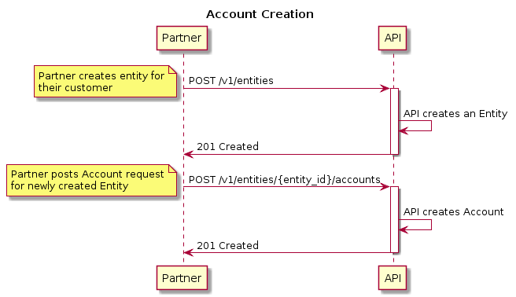

# solaris Digital Assets Platform API Guide

An API platform that provides a managed custody solution for storing digital assets.

* Version: [0.12.0]
* Updated: [2020-04-07]

## Introduction

The solaris Digital Assets Platform API is designed to allow partners to store digital asset funds on the platform, accept deposits, process withdrawals and keep track of balances in digital assets.

The partner can own a collection of Wallets on our platform, where each Wallet holds the funds owned by the partner for some specific digital asset. There are two types of Wallets:

* Segregated Wallet
* Pooled Wallet

### Segregated Wallet

All the funds in the Wallet belong to Entity, which represents end customer or the partner themselves. On top of the Wallet an Account needs to be created.

The partner can create many Addresses associated with an Account, which can be used to deposit funds there.

The partner can initiate Withdrawals to an external address, within the existing Account balance.

### Pooled Wallet

All the funds in the Wallet are treated as a single pool and there is no separation on the Wallet level between balances of individual customers.

The partner controls and can register Entities on our platform, which represent end customers or the partner themselves as Account holders.

On top of the Wallet there can be many Accounts created, each Account associated with a registered Entity.

The partner can create Addresses associated with an Account, which can be used to deposit funds there.

The partner can initiate Withdrawals to an external address or Transfers to a different Account from an Account on behalf of the Account holder, within the existing Account balance.

> At the moment we create a single Pooled Wallet per partner, only for Bitcoin (BTC) funds. However API is designed to provide similar workflow to all other digital assets when supported by the platform.


## Setup

Before a partner can use the solaris Digital Assets Platform API we register them in our system. This happens completely on our side and is not exposed by API endpoints.

During this process we are going to create a Wallet for the partner, a partner Entity, and an Account owned by the partner Entity in the created Wallet.

The next step is to create a key pair that is going to be used by the partner to access the API. This happens on partner side, then the partner sends us the public key part. At no point the solaris Digital Assets Platform platform learns the corresponding private key.

The Private key is used by the partner to sign every API request and the public key is used by solaris Digital Assets' API to verify the ownership and integrity of the request. We will provide additional instructions on how to generate key pairs combined with authentication code examples as separate document guide.

Finally we register the public key received from the partner, after which the partner can access the API.

## Authentication

We require our partners to generate a pair of private & public keys.
Partners MUST register the public key with the Platform and sign every request to our API
using their private key.

We are using *HTTP Signatures* IETF draft as the base for our authentication mechanism.
As the digital signature algorithm in HTTP Signatures we are using *Ed25519*.

Every HTTP request to the API MUST have following headers in addition to
standard ones:

* Digest
* X-Nonce
* Signature

### Digest Header

The `Digest` header ensures integrity of the HTTP request body. It MUST be constructed
following the HTTP Instance Digests RFC using SHA-256 algorithm.

In case of GET request, the `Digest` header still must be constructed, assuming the request
body is an empty string.

See:

* Instance Digests in HTTP <https://tools.ietf.org/html/rfc3230>
* Additional Hash Algorithms for HTTP Instance Digests <https://tools.ietf.org/html/rfc5843>

Example:
```
Digest: SHA-256=X48E9qOokqqrvdts8nOJRJN3OWDUoyWxBf7kbu9DBPE=
```

### X-Nonce Header

The `X-Nonce` header is supposed to uniquely identify the HTTP request
and serves to protect against replay/playback attacks.
The `X-Nonce` header value MUST be a string of up to 32 characters,
which MUST be  unique across all the requests generated using the same
API key.

As an example, `X-Nonce` header value may be generated as 16-bytes
random integer in hexadecimal representation.

Example:
```
X-Nonce: 514bdd41b15f6b1a0443f8c673adc9db
```

### Signature Header

Signature Header string is used to provide authentication and integrity assurances
without the need for shared secrets. It also does not require an additional round-trip
in order to authenticate the client and allows the integrity of a message to be verified
independently of the transport.

Signature Parameters:

* **keyId**

  Unique ID which is assigned to the Partner's API key.

* **algorithm**

  The value for the `algorithm` parameter MUST be `"hs2019"`.

* **created**

  The value of the `created` parameter MUST be the time at which
  the HTTP request was constructed as an integer Unix timestamp.

* **headers**

  The `headers` parameter identifies how the canonical Signature String is constructed.
  Its value consists of a list of actual and pseudo- HTTP headers which will form
  the Signature String according to the HTTP Signatures draft v11.

  The `headers` parameter MUST include following
  headers: `(request-target)`, `(created)`, `digest`, `x-nonce`.

  The recommended value of the `headers` parameter is:
  `(request-target) (created) digest x-nonce`.

  See:

  * Signature String Construction
    <https://tools.ietf.org/html/draft-cavage-http-signatures-11#section-2.3>

  Example of Signature String for `headers="(request-target) (created) digest x-nonce"`:

  ```

  (request-target): get /foo?bar=123\n
  (created): 1557855475\n
  digest: SHA-256=47DEQpj8HBSa+/TImW+5JCeuQeRkm5NMpJWZG3hSuFU=\n
  x-nonce: 7c44d38b63f5e398af62d603b1155f5c

  ```

  Here `\n` indicate the ASCII newline character. Note the absence of it on the last line.

* **signature**

  The value of the `signature` parameter is the digital signature of the HTTP request produced
  by the partner's private key.

  In order to create the `signature` parameter:

  * Construct the canonical Signature String according to the value of the `headers` parameter
  * Using the private key that corresponds to the provided `keyId` generate an Ed25519
    signature of the Signature String obtained on a previous step
  * Base64-encode the signature

### Examples

```
POST /foo/bar
Digest: SHA-256=X48E9qOokqqrvdts8nOJRJN3OWDUoyWxBf7kbu9DBPE=
X-Nonce: 514bdd41b15f6b1a0443f8c673adc9db
Signature: keyId="foobar",algorithm="hs2019",created=1557855475,headers="(request-target) (created) digest x-nonce",signature="IKGyxGiUFm3luudWGkTzf0TYQD2Fnkb6ed6BTfuXuDq/U9q6gQk6KxBSPx33ME1O2RLlH5HKG2WZnO8PgRGiDA=="

{"hello": "world"}
```

```
GET /foo?bar=123
Digest: SHA-256=47DEQpj8HBSa+/TImW+5JCeuQeRkm5NMpJWZG3hSuFU=
X-Nonce: 7c44d38b63f5e398af62d603b1155f5c
Signature: keyId="foobar",algorithm="hs2019",created=1557855475,headers="(request-target) (created) digest x-nonce",signature="d0Wzjlpt2Y++DJtxKnD1ipkkwF5eU43jwtybqsy3tFqa5P3kYYIJa4TTQyMUZ62i58jwN7gK6q2MVJBDGQ6tDg=="
```

See:

* HTTP Signatures, <https://tools.ietf.org/html/draft-cavage-http-signatures-11>
* Ed25519, <https://ed25519.cr.yp.to/>


## IDs

All resources exposed by the API have uniform unique ID scheme, which follows the scheme of solarisBank API — an ID is a String of 36 characters.

### Example

```
{
  "person_id": "5b1c711ef5cf4b7012b688616ed052d3cper"
}
```

## Assets

An Asset in our system represents a single digital asset of some kind. This can be a cryptocurrency (e.g. Bitcoin), a token (ERC20) or some other type of asset.

Any Asset has an artificial unique identifier and some additional details. For example, an ISO currency code equivalent, a human readable description, and other individual properties of an asset like the amounts precision or the address validation rules.

The Asset identifiers are the only way to refer a specific asset on our platform. Any other forms of reference, like an ISO code, are not considered immutable and/or unique.

The API provides a way to list all Assets supported by the platform:

See:

```
GET /v1/assets
GET /v1/assets/{asset_id}
```

### Example

```
GET /v1/assets/00000000000000000000000000000001asst
```

```
200 OK

{
  "id": "00000000000000000000000000000001asst",
  "code": "BTC",
  "precision": 8,
  "description": "Bitcoin",
  "created_at": "2019-01-17T17:05:44Z"
  "updated_at": "2019-01-17T17:05:44Z"
}
```

## Wallets

The API provides a way to list all the Wallets owned by the partner or to fetch an individual Wallet's details.

Since the Wallets are created outside of the API interaction, the partner can list all available Wallets to learn the individual Wallet IDs.

See:

```
GET /v1/wallets
GET /v1/wallets/{wallet_id}
```

### Example

```
GET /v1/wallets/82b46f5310d8a35fb4755cc13fddd681walt
```

```
200 OK

{
  "id": "82b46f5310d8a35fb4755cc13fddd681walt",
  "asset_id": "00000000000000000000000000000001asst",
  "balance": "123.45670000",
  "created_at": "2019-03-17T09:38:04Z",
  "updated_at": "2019-04-02T12:27:33Z"
}
```


## solaris Digital Assets recommendation: End customer onboarding

Before a partner can offer their customers the full feature set of solaris Digital Assets' API, the partner must onboard the customer. We recommend the following steps to fully onboard the customer:

### solarisBank Identity API

1. Partner should [create a person](https://docs.solarisbank.com/core/api/v1/#44qZGy7K-post-create-a-person) (end customer of Partner)
2. Partner should [create an identification](https://docs.solarisbank.com/core/api/v1/#6Q8p3mGx-person-identification) for the person with a selected method
  * Once the identification has been created, Partner should request an identification link for the respective end customer by fetching a dedicated URL
  * Identification needs to be completed successfully.  Should an identification not reach a final status, the existing link can be reused.

### solaris Digital Assets API

1. Partner should create an Entity for the person (see: Entity)
2. Partner should create an approval method for the Entity (see: Approval Methods)
  * Approval Method should be activated by the Entity
3. Partner should create an Account for the Entity (see: Accounts)
  * Partner should create an Address for the Account (see: Addresses)


> NOTE: The order above is just solaris Digital Assets' recommendation. Creating a Person is a prerequisite to further develop on top of solaris Digital Assets' API.
> Certain functionalities, like creating Account and Addresses is possible without successful KYC of an end customer. Although, for example in an event of a detected
> Deposit, funds will never be unlocked until the KYC has been successfully completed. Hence, Withdrawals or Transfers will be not possible either.

#### Requirements for the end customer to be able to perform transactions:

* Person created (sB Identity API)
* KYC successfully completed (sB Identity API)
* Entity created (sDA API)
* Approval method successfully created and verified for the entity (sDA API)
* Account and associated address created (sDA API)


## Entities

During the setup phase we only create one Entity of type `PARTNER`,  which represents the partner as an Account holder.

To be able to create Accounts on behalf of end customers, the partner MUST beforehand create corresponding Entities of type `PERSON`. During this process the partner MUST provide a `person_id` — a unique identifier of an individual provided by solarisBank KYC product.

See:

```
POST /v1/entities
GET /v1/entities
GET /v1/entities/{entity_id}
```

### Example

```
POST /v1/entities

{
  "person_id": "5b1c711ef5cf4b7012b688616ed052d3cper"
}
```

```
201 Created

{
  "id": "10ef67dc895d6c19c273b1ffba0c1692enty",
  "type": "PERSON",
  "person_id": "5b1c711ef5cf4b7012b688616ed052d3cper",
  "created_at": "2019-04-02T12:27:33Z",
  "updated_at": "2019-04-02T12:27:33Z"
}
```

## Accounts

An Account represents an aggregation of funds attributed to some registered Entity as an Account holder. It can be an end customer or the partner owning an Account. The association between the Account and its owner is permanent.

To create an Account, the partner MUST provide a reference to an existing Entity and the Wallet.



### Account Balance

The Account resource provided by the API contains the `balance` attribute, which represents
the Account Balance. Accounts start with having a balance of 0.

Every successfully processed Transaction increases or decreases the Account Balance
by creating corresponding Ledger Entries.
As such the Account Balance equals to the sum of all Ledger Entries of this Account.


### Account Available Balance

Whenever a Transaction that transfers funds out of the Account is requested,
for example Withdrawal or Transfer, the Account Balance is not immediately reduced.
It is only when the Transaction is approved by the Customer or the Partner,
and then processed by the platform, the corresponding Account Balance is updated.

At the same time, even though after requesting a Transaction the Account Balance
didn't change, it does not mean that all of it can be spent, as there is a pending
Transaction in the processing pipeline.

To mitigate that and improve user experience, every Account also exposes
the `available_balance` attribute, which represents
the current Account Available Balance.

The Account Available Balance displays how much can be spent by the next requested
Transaction.

See:

```
POST /v1/entities/{entity_id}/accounts
GET /v1/entities/{entity_id}/accounts
GET /v1/entities/{entity_id}/accounts/{account_id}
```

### Example

```
POST /v1/entities/10ef67dc895d6c19c273b1ffba0c1692enty/accounts

{
  "wallet_id": "82b46f5310d8a35fb4755cc13fddd681walt"
}
```

```
201 Created

{
  "id": "9c41ec8a82fb99b57cb5078ae0a8b569acct",
  "wallet_id": "82b46f5310d8a35fb4755cc13fddd681walt",
  "entity_id": "10ef67dc895d6c19c273b1ffba0c1692enty",
  "balance": "0.00000000",
  "available_balance": "0.00000000",
  "created_at": "2019-02-02T13:41:34Z",
  "updated_at": "2019-02-02T13:41:34Z"
}
```

## Addresses

An Address represents a blockchain-level digital asset address associated with an Account. This Address can be used to make deposits to the Account.

There can be many Addresses created and associated with an Account, and once created the Addresses stay permanently valid and permanently associated with the Account. This is how we track the ownership of funds deposited to some blockchain-level address.

See:

```
POST /v1/entities/{entity_id}/accounts/{account_id}/addresses
GET /v1/entities/{entity_id}/accounts/{account_id}/addresses
GET /v1/entities/{entity_id}/accounts/{account_id}/addresses/{address_id}
```

### Example

```
POST /v1/entities/10ef67dc895d6c19c273b1ffba0c1692enty/accounts/9c41ec8a82fb99b57cb5078ae0a8b569acct/addresses

{}
```

```
201 Created

{
  "id": "42049cb01a6962d0232223e632aac68baddr",
  "account_id": "9c41ec8a82fb99b57cb5078ae0a8b569acct",
  "address": "1F1tAaz5x1HUXrCNLbtMDqcw6o5GNn4xqX",
  "created_at": "2019-02-02T13:43:34Z",
  "updated_at": "2019-02-02T13:43:34Z"
}
```

## Transactions

A Transaction represents an operation that affected the balance of the Account.

Transactions have a `type` attribute, which describes the operation:

* DEPOSIT
* WITHDRAWAL
* WITHDRAWAL_PROCESSING
* TRANSFER_OUTGOING
* TRANSFER_INCOMING

In addition Transaction have following attributes:

| name                | type    | desc                                          |
|---------------------|---------|-----------------------------------------------|
| account_id          | String  | ID of the account tx belongs to               |
| state               | String  | State of the tx, e.g. "PENDING"               |
| amount              | Decimal | Transacted amount, positive or negative       |
| fee_amount          | Decimal | Charged fee, always positive or 0             |
| total_amount        | Decimal | Credited/debited amount, positive or negative |

`total_amount` indicates by how much the account balance have changed. It always equals to `amount - fee_amount`.

Other attributes may be present, depending on the type of Transaction.

See:

```
GET /v1/entities/{entity_id}/accounts/{account_id}/transactions
GET /v1/entities/{entity_id}/accounts/{account_id}/transactions/{transaction_id}
```

### Example

```
GET /v1/entities/10ef67dc895d6c19c273b1ffba0c1692enty/accounts/9c41ec8a82fb99b57cb5078ae0a8b569acct/transactions
```

```
200 OK

{
  "items": [
    {
      "id": "bf20c716075ea82a4b1f3f0b49657161atrx",
      "account_id": "9c41ec8a82fb99b57cb5078ae0a8b569acct",
      "type": "DEPOSIT",
      "state": "PENDING",
      "amount": "1.12340000",
      "fee_amount": "0.00000000",
      "total_amount": "1.12340000",
      "created_at": "2019-04-02T13:15:47Z",
      "updated_at": "2019-04-02T13:15:47Z"
    },
    {
      "id": "4368fe9ac68c3215b2432a6acffddee8atrx",
      "account_id": "9c41ec8a82fb99b57cb5078ae0a8b569acct",
      "type": "WITHDRAWAL",
      "state": "COMPLETED",
      "amount": "-0.80000000",
      "fee_amount": "0.12340000",
      "total_amount": "-0.92340000",
      "reference": "unique-a8e530db9b0e3ba8-blah",
      "created_at": "2019-04-02T13:18:51Z",
      "updated_at": "2019-04-02T13:18:51Z"
    },
    {
      "id": "27341700f516438c28632e8d973a6c59atrx",
      "account_id": "9c41ec8a82fb99b57cb5078ae0a8b569acct",
      "type": "TRANSFER_OUTGOING",
      "state": "COMPLETED",
      "amount": "-0.50000000",
      "fee_amount": "0.00000000",
      "total_amount": "-0.50000000",
      "reference": "example of reference",
      "sender_account_id": "9c41ec8a82fb99b57cb5078ae0a8b569acct",
      "receiver_account_id": "f0cfb103e6c3d4a37c2750a1256862a3acct",
      "created_at": "2019-04-02T13:18:51Z",
      "updated_at": "2019-04-02T13:18:51Z"
    },
    {
      "id": "kajsdhfkjh241k43aslkdjf1h5kjh9atrx",
      "account_id": "9c41ec8a82fb99b57cb5078ae0a8b569acct",
      "type": "WITHDRAWAL_PROCESSING",
      "state": "COMPLETED",
      "amount": "-0.50000000",
      "fee_amount": "0.00000000",
      "total_amount": "-0.50000000",
      "blockchain_txid": "648a0e4262c0edf6485ac8628bbb5411250ca057448a3125f2e36ce96e09bc28",
      "created_at": "2019-04-02T13:18:51Z",
      "updated_at": "2019-04-02T13:18:51Z"
    }
  ]
}
```

### Transaction Processing Workflow

Each Transaction has a "state" attribute, that can take any value of:

* PENDING
* APPROVED
* COMPLETED
* FAILED

Whenever a Transaction is created, it starts in a PENDING state.

Before the Transaction can be processed by the Platform, the initiator of Transaction
MUST approve it. For the Transactions requested by the partner, i.e. a Withdrawal or a Transfer,
it should be the corresponding Account holder. Other Transaction types are automatically created
and approved by the Platform, in response to some external events, e.g. a Deposit is created
whenever a blockchain transaction it spotted on the network, and it is approved
whenever the blockchain transaction is sufficiently confirmed.

A Transaction in APPROVED state means that the initiator of the Transaction has approved it,
and the Transaction is accepted for processing by the Platform. Depending on the type of
Transaction, it can stay in this state for a significant amount of time, for example:
* processing of the Transaction can be naturally delayed, as in the case of batching
  of multiple Withdrawals
* performing Compliance checks can delay a Transaction

COMPLETED state means that the Transaction has been successfully processed, and the Account
balance has been updated. This state is final.

> NOTE: It's up to partner how to present the Transaction states to the end customer. An important
> distinction would be that both PENDING and APPROVED states mean that the Transaction
> is still being processed, and only COMPLETED state means the Transaction is finalized.

In case of a failure that prevents the Transaction from being successfully processed,
a Transaction can transition to FAILED state. Any amount which was locked
by such Transaction will be released, and the Account Available balance will be updated.
This state is final.

Whenever a Transaction is requested by the partner, the platform runs validation checks on this
Transaction. If any of these checks fail, the Transaction will be created and immediately
set to FAILED state. This can happen, for example, when the corresponding Account
does not have sufficient balance to process this Transaction.

## Deposits

A Deposit is a Transaction of type DEPOSIT. A Deposit represents a single incoming blockchain-level transfer to some Account Address.

Whenever a blockchain transaction is made to one of the addresses created using the API, the sequence is following:

* The transaction is first detected on the network and is registered on the platform as a new Transaction of type DEPOSIT
* The partner can then see the Deposit in the list of Account Transactions and start tracking its state
* The transaction is confirmed by the network and the corresponding Transaction of type DEPOSIT state is changed on the platform, crediting the funds
* The partner can detect the state change by polling for the individual Transaction details or by listing the Account Transactions

### Example

```
GET /v1/entities/10ef67dc895d6c19c273b1ffba0c1692enty/accounts/9c41ec8a82fb99b57cb5078ae0a8b569acct/transactions/bf20c716075ea82a4b1f3f0b49657161atrx
```

```
200 OK

{
  "id": "bf20c716075ea82a4b1f3f0b49657161atrx",
  "account_id": "9c41ec8a82fb99b57cb5078ae0a8b569acct",
  "type": "DEPOSIT",
  "state": "PENDING",
  "amount": "1.12340000",
  "fee_amount": "0.00000000",
  "total_amount": "1.12340000",
  "created_at": "2019-04-02T13:15:47Z",
  "updated_at": "2019-04-02T13:15:47Z"
}
```

## Withdrawals

A Withdrawal is a Transaction of type WITHDRAWAL. A Withdrawal represents a single transfer of funds from an Account to some external blockchain-level address.

### Withdrawal Fee Model

During a Withdrawal processing the platform charges the Withdrawal Fee on the originating Account on behalf of the partner and credits the amount to the partner Entity Account. The Withdrawal Fee charged here is completely configurable by the partner (or can be waived by the partner altogether).

Depending on the underlying blockchain, the platform can batch multiple Withdrawals together and broadcast them in a single blockchain transaction. For the transactions happening on the blockchain-level the platform charges the full network fees amount on the partner Entity Account.

### Processing a Withdrawal

To issue a Withdrawal on behalf of the customer, the partner creates a new Withdrawal object and provides a `reference` value, which MUST be unique across all Transactions of this partner and serves as idempotency key.

The Withdrawal is then registered on the platform and validated, after which the customer
(as an Account holder) MUST approve the Withdrawal. See [Transaction Approvals].

Once Withdrawal is validated and approved, the platform proceeds to queueing the Withdrawal for processing.

Periodically multiple Withdrawals from the same Wallet are grouped together in a single blockchain-level transaction, which is signed and eventually broadcasted. At this moment the platform creates a corresponding
Withdrawal Processing Transaction that charges the processing fee, which  matches the network fees,
on the partner Entity Account.

Withdrawals are NOT going to be processed if the partner Entity Account cannot pay the processing fees.

After a corresponding blockchain-level transaction is broadcasted on the network,
all included Withdrawals are completed and their blockchain reference attributes are updated.

See:

```
POST /v1/entities/{entity_id}/accounts/{account_id}/transactions/withdrawal
```

### Example

```
POST /v1/entities/10ef67dc895d6c19c273b1ffba0c1692enty/accounts/9c41ec8a82fb99b57cb5078ae0a8b569acct/transactions/withdrawal

{
  "reference": "unique-a8e530db9b0e3ba8-blah",
  "address": "3D2oetdNuZUqQHPJmcMDDHYoqkyNVsFk9r",
  "amount": "1.00000000"
}
```

```
201 Created

{
  "transaction_id": "bede420fae7624091f337c22f9714fc0atrx"
}
```

## WithdrawalProcessing Transactions

A WithdrawalProcessing is a Transaction of type WITHDRAWAL_PROCESSING.
The Digital Assets Platform processes Withdrawal Transactions in batches to include as many
Withdrawals as possible in one single network transaction.
When the batch of Withdrawals is processed and a network transaction has been broadcasted to the network,
then a Transaction of type WITHDRAWAL_PROCESSING is created by the Digital Assets Platform.
This WithdrawalProcessing Transaction represents a single transfer of funds
from the Partner Entity’s Account and is used to pay the actual network fees for
the network transaction.

The WithdrawalProcessing Transaction has an attribute `amount` that represents the amount
that is moved on the Partner Entity’s fee paying Account. The `amount` can be negative or positive.
The `amount` is calculated as follows:
`(SUM of the `fee_amounts` of all Withdrawals included in a network transaction) MINUS the actual network transaction fee`.

As the `fee_amounts` of the Withdrawals are only an estimate they can be less or more than
the actual fee that needs to be paid to the network thus leading to a positive or negative
amount that will be taken from or credited to the Partner Entity’s fee paying Account.

See:

```
GET /v1/entities/{entity_id}/accounts/{account_id}/transactions
```

### Example

```
GET /v1/entities/10ef67dc895d6c19c273b1ffba0c1692enty/accounts/9c41ec8a82fb99b57cb5078ae0a8b569acct/transactions/9c41ec8a82fb99b57cb5078ae0a8b569atrx

200 OK

{
  "id": "9c41ec8a82fb99b57cb5078ae0a8b569atrx",
  "account_id": "9c41ec8a82fb99b57cb5078ae0a8b569acct",
  "type": "WITHDRAWAL_PROCESSING",
  "state": "COMPLETED",
  "amount": "-0.50000000",
  "fee_amount": "0.00000000",
  "total_amount": "-0.50000000",
  "blockchain_txid": "648a0e4262c0edf6485ac8628bbb5411250ca057448a3125f2e36ce96e09bc28",
  "created_at": "2019-04-02T13:18:51Z",
  "updated_at": "2019-04-02T13:18:51Z"
}
```

## Transfers

A Transfer represents a transfer of funds from one Account to another within the same Wallet.
This operation is not reflected externally as a blockchain transaction or any other observable event.
It can be a Transfer between an end customer and a partner Accounts, or a Transfer between two end customer Accounts.

On the API level a Transfer is represented as two Transactions, one in the sender Account, having
the type TRANSFER_OUTGOING, and one in the receiver Account, having the type TRANSFER_INCOMING.


### Processing a Transfer

To issue a Transfer on behalf of the Account holder, the partner issues a request to create a Transfer
on the sender Account and provides a `reference` value, which MUST be unique across all Transactions
of this partner and serves as idempotency key.

To reference a receiver Account of the Transfer, the partner MUST provide an ID of that Account.

After the Transfer request is validated and a Transfer (Outgoing) Transaction is created
by the platform, the Transaction MUST be approved by the customer (as an Account holder).
See [Transaction Approvals].

A Transaction of type TRANSFER_OUTGOING is created under the originating (sender) Account
debiting the funds, and another Transaction of type TRANSFER_INCOMING crediting the funds
is created in the receiving (receiver) Account, once the corresponding TRANSFER_OUTGOING
Transaction has been completed.


See:

```
POST /v1/entities/{entity_id}/accounts/{account_id}/transactions/transfer
```

### Example

```
POST /v1/entities/10ef67dc895d6c19c273b1ffba0c1692enty/accounts/9c41ec8a82fb99b57cb5078ae0a8b569acct/transactions/transfer

{
  "reference": "unique-32d57e1d72b9b5fa-blah",
  "receiver_account_id": "e0c7cea27569ba4c59572e4073ee823bacct",
  "amount": "1.00000000"
}
```

```
201 Created

{
  "transaction_id": "fd213476ad3a1f2df48c7cbca394f3edatrx",
}
```

## Approval Methods

Approval Method defines the particular MFA mechanism that the Account holder (Entity) can use
to approve their Transactions.

Currently there are following Approval Method types supported by the platform:

* `AUTHY_PUSH` -- represents a Authy push notifications based MFA
* `DSA_ED25519` -- represents an ECDSA based MFA mechanism

In order to be able to approve Transactions by the corresponding Account holder (an Entity
of type `PERSON` or `PARTNER`), there MUST be a registered and activated Approval Method
for this Entity.

When first registered, an Approval Method is in a `PENDING` state. Then, depending on
Approval Method type, it can be activated by the platform operator or by the customer.

Only the Approval Method in `ACTIVATED` state can be used to approve Transactions.

Currently there can be only one Approval Method of each type registered for an Entity.

See:
```
POST /v1/entities/{entity_id}/approval_methods
GET /v1/entities/{entity_id}/approval_methods
GET /v1/entities/{entity_id}/approval_methods/{approval_method_id}
```

### Authy push notifications

This Approval Method is aimed at customers (individual people) as Account holders,
and can only be registered for Entities of type `PERSON`.


#### Setup

The corresponding Entity of type `PERSON` MUST be registered.

#### Register this Approval Method for an Entity

To register this Approval Method for an Entity, only `type` attribute is required.

Example:
```
POST /v1/entities/df8bd407b3dfbd37f8ff3e5efbd4e8acenty/approval_methods

{
  "type": "AUTHY_PUSH"
}
```
```
201 Created

{
  "id": "b2046aec77bdd03dc0db46e57e0a722bapmt",
  "entity_id": "df8bd407b3dfbd37f8ff3e5efbd4e8acenty",
  "type": "AUTHY_PUSH",
  "state": "PENDING",
  "created_at": "2019-11-03T12:21:16Z",
  "updated_at": "2019-11-03T12:21:16Z"
}
```

#### Activation

Registering an Approval Method of type `AUTHY_PUSH` for an Entity will automatically trigger
this customer's enrollment at Authy service, provided they have successfully completed their KYC
process. If the KYC process for this customer is not complete, the automatic enrollment
at Authy will be delayed until it is.

The activation of this Approval Method is controlled by the customer and may or may not
require additional setup on their part, depending on whether they have already registered
at Authy with the phone number they provided during the KYC process or not.

1. **Customer is already registered at Authy**:
  In case the customer is already registered at Authy with the same phone number they provided
  during the KYC process, there will be a push notification sent to the customer in their Authy app,
  asking/notifying them to add another application.

2. **Customer is not registered at Authy**:
  In case the customer is not registered at Authy, or registered with a different phone number,
  they MUST install an Authy app on their (mobile) device and
  bind it to the same phone number they have provided during the KYC process.

This Approval Method is automatically activated as soon as the customer successfully registers
at Authy, installs and configures the Authy app on their (mobile) device.


Example:
```
GET /v1/entities/df8bd407b3dfbd37f8ff3e5efbd4e8acenty/approval_methods/b2046aec77bdd03dc0db46e57e0a722bapmt

200 OK

{
  "id": "b2046aec77bdd03dc0db46e57e0a722bapmt",
  "entity_id": "df8bd407b3dfbd37f8ff3e5efbd4e8acenty",
  "type": "AUTHY_PUSH",
  "state": "ACTIVATED",
  "created_at": "2019-11-03T12:21:16Z",
  "updated_at": "2019-11-03T12:46:10Z"
}
```


### DSA_ED25519

This Approval Method is designed for automated systems or custom integrations
(e.g. custom mobile apps). Currently this Approval Method is only available
for Entity of type `PARTNER`.

Approving a Transaction using this method works in the following way:

* a challenge is constructed in some deterministic way from the Transaction attributes
* the challenge is signed by the Approval key (private) held by Account holder (Entity)
* the signature is sent as a challenge response to the Platform
* platform verifies the response, using previously registered Approval key (public)
  of the Account holder (Entity)


#### Setup

The corresponding Entity of type `PARTNER` MUST be registered.

To utilize this method, the partner MUST generate an *Approval key* and store it.

The public part of this key is to be submitted to the platform with the Approval Method
registration request.

**Approval key** -- an Ed25519 key pair which Partner is going to use for approving Transactions.
This key SHOULD be different from Partner's API key.


#### Register this Approval Method for an Entity

To register this Approval Method, partner submits a request with `type` and `pub_key` attributes,
where `pub_key` is the public key part of the *Approval key* as a 32-byte hexadecimal string.


Example:
```
POST /v1/entities/bda8720b93a2daf3ffac5a6fefaa87aaenty/approval_methods

{
  "type": "DSA_ED25519",
  "pub_key": "eeb4ff2aa97bdead6df6b4bc44cde6e41d257cc05dd4f803dbeb8d30c908beeb"
}
```
```
201 Created

{
  "id": "6d4e8abbaab25847a01908c6f02f8bb0apmt",
  "entity_id": "bda8720b93a2daf3ffac5a6fefaa87aaenty",
  "type": "DSA_ED25519",
  "state": "PENDING",
  "pub_key": "eeb4ff2aa97bdead6df6b4bc44cde6e41d257cc05dd4f803dbeb8d30c908beeb"
  "created_at": "2019-11-03T13:05:51Z",
  "updated_at": "2019-11-03T13:05:51Z"
}
```

#### Activation

This Approval Method is activated by a manual process, controlled by the platform operator.

During this process the platform operator MAY contact the partner representatives
using other communication channels to confirm the validity of the public key.

Example:
```
GET /v1/entities/bda8720b93a2daf3ffac5a6fefaa87aaenty/approval_methods/6d4e8abbaab25847a01908c6f02f8bb0apmt

200 OK

{
  "id": "6d4e8abbaab25847a01908c6f02f8bb0apmt",
  "entity_id": "bda8720b93a2daf3ffac5a6fefaa87aaenty",
  "type": "DSA_ED25519",
  "state": "ACTIVATED",
  "pub_key": "eeb4ff2aa97bdead6df6b4bc44cde6e41d257cc05dd4f803dbeb8d30c908beeb"
  "created_at": "2019-11-03T13:05:51Z",
  "updated_at": "2019-11-03T13:05:51Z"
}
```

## Approval Requests

Any Transaction initiated by an API request (i.e. Withdrawal or Transfer) MUST be approved
by the corresponding Account holder (an Entity owning the Transaction's Account),
before it will be processed and executed by the Platform.

Transaction Approval process consists of two steps:

* Creating a new ApprovalRequest for a Transaction
* Approving the ApprovalRequest

There are different Approval Methods supported which determine how an ApprovalRequest will
be used to approve a Transaction. Different Approval Methods are available for different types
of Account holders:


* Entity of type PERSON -- an ApprovalRequest of type `AUTHY_PUSH`
* Entity of type PARTNER -- an ApprovalRequest of type `DSA_ED25519`


The method of approval for an ApprovalRequest depends on the type of the ApprovalMethod
which is associated with the ApprovalRequest.

### Approval Method: AUTHY_PUSH

This appproval method is aimed at customers (individual people) as Account holders.
In order to approve an ApprovalRequest of type `AUTHY_PUSH` a customer must have the Authy app installed and activated on their smartphone.

* Partner initiates a request to the Platform's API requesting the creation of an ApprovalRequest
* A challenge is sent to the Customer's smartphone using a secure channel
* The Customer approves or denies the ApprovalRequest
* The Platform retrieves the response for the challenge
* When the ApprovalRequest was approved the Platform processes the Transaction
* When the ApprovalRequest was denied the Platform cancels the Transaction
* When the Customer takes no action, the ApprovalRequest will fail after a configurable period. This will also fail the Transaction.

#### Setup

see Approval Method `AUTHY_PUSH` to see how this Approval Method is set up.

#### Challenge

The Challenge for an ApprovalMethod of type `AUTHY_PUSH` will be sent to the customer's smartphone via a secure channel and thus will bypass the Partner for added security.

```
POST /v1/entities/{entity_id}/accounts/{account_id}/transactions/{transaction_id}/approval_request
{
  "type": "AUTHY_PUSH"
}
```
```
201 Created

{
  "id": "bd4c882738787267cdf849fcb799b45eaprq",
  "transaction_id": "9c41ec8a82fb99b57cb5078ae0a8b569atrx",
  "type": "AUTHY_PUSH",
  "state": "PENDING",
  "created_at": "2019-11-23T13:05:51Z",
  "updated_at": "2019-11-23T13:05:52Z"
}
```

#### Fetching the state of the ApprovalRequest

To see the state of an ApprovalRequest the Partner can use the following endpoint:

```
GET /v1/entities/{entity_id}/accounts/{account_id}/transactions/{transaction_id}/approval_request

```
```
200 Ok

{
  "id": "bd4c882738787267cdf849fcb799b45eaprq",
  "transaction_id": "9c41ec8a82fb99b57cb5078ae0a8b569atrx",
  "type": "AUTHY_PUSH",
  "state": "APPROVED",
  "created_at": "2019-11-23T13:05:51Z",
  "updated_at": "2019-11-23T13:06:28Z"
}
```

### Approval method: DSA_ED25519

This approval method is designed for automated systems or custom integrations
(e.g. custom mobile apps). Currently this approval method is only available
for Entity of type `PARTNER`.

Provided the Approval method is registered for the Entity and it is activated
by the platform operator, approving a Transaction using this method works in the following way:

* an Approval request of type `DSA_ED25519` is created for the Transaction,
  which contains a Transaction specific challenge
* a challenge message is constructed in some deterministic way from the Transaction attributes
* the challenge message is signed by the Approval key (private) held by Account holder (Entity)
* the signature is sent as a challenge response to the Platform
* platform verifies the response, using an Approval key (public)
  previously registered for the `DSA_ED25519` Approval method of the Account holder (Entity)

#### Setup

see Approval Method `DSA_ED25519` to see how this Approval Method is set up.


#### Challenge

The challenge for the DSA_ED25519 method is represented by a *Challenge message*,
that the holder of Approval key should sign and send the signature as the response.

```
POST /v1/entities/{entity_id}/accounts/{account_id}/transactions/{transaction_id}/approval_request

{
  "type": "DSA_ED25519"
}
```
```
201 Created

{
  "id": "ba9e224ba82ea200114803e5ce3ee839aprq",
  "transaction_id": "fc069dcbb6649ad7b5afb7210ef4d9d2atrx",
  "type": "DSA_ED25519",
  "state": "PENDING",
  "challenge": {
    "attrs": ["id", "account_id", "type", ...] # Transaction attribute names
  },
  "created_at": "2019-11-26T17:17:17Z",
  "updated_at": "2019-11-26T17:17:17Z"
}
```

The *Challenge message* is constructed from Transaction attributes and a list of
attribute names returned in `challenge.attrs` in the following way:

1. For each *attribute_name* from the `challenge.attrs` list, construct the *attribute_string*
  in the following way: concatenate the *attribute_name*, ASCII colon `:`, ASCII space ` `
  and the value of corresponding Transaction attribute
1. Construct the *Challenge message* by concatenating *attribute_string*'s in the same
  order as the corresponding attributes in `challenge.attrs`,
  using ASCII newline `\n` as the delimiter.
  NOTE: the resulting string does NOT end with `\n`.

##### Example

Suppose there is a Withdrawal Transaction:
```
{
  "id": "f4342c75f714405d89007ef13ce68688atrx",
  "account_id": "f52b22a8256cd2b0ad21f3c2cc2c5875acct",
  "type": "WITHDRAWAL",
  "state": "PENDING",
  "amount": "-0.00000001",
  "fee_amount": "1.00000000",
  "total_amount": "-1.00000001",
  "address": "1A1zP1eP5QGefi2DMPTfTL5SLmv7DivfNa",
  "reference": "some-reference-ea1ee054",
  "created_at": "2019-08-21T10:47:34Z",
  "updated_at": "2019-08-21T10:47:34Z"
}
```

And the Approval request contains the following challenge:
```
GET /v1/.../f4342c75f714405d89007ef13ce68688atrx/approval_request
```
```
200 OK

{
  "id": "ba9e224ba82ea200114803e5ce3ee839aprq",
  "transaction_id": "f4342c75f714405d89007ef13ce68688atrx",
  "type": "DSA_ED25519",
  "state": "PENDING",
  "challenge": {
    "attrs": ["id","account_id","type,amount","fee_amount","total_amount","address","reference"]
  },
  "created_at": "2019-08-21T10:47:34Z",
  "updated_at": "2019-08-21T10:47:34Z"
}
```

Then the computed *Challenge message* is:
```
id: f4342c75f714405d89007ef13ce68688atrx\n
account_id: f52b22a8256cd2b0ad21f3c2cc2c5875acct\n
type: WITHDRAWAL\n
amount: -0.00000001\n
fee_amount: 1.00000000\n
total_amount: -1.00000001\n
address: 1A1zP1eP5QGefi2DMPTfTL5SLmv7DivfNa\n
reference: some-reference-ea1ee054
```

> NOTE: the `\n` above represent the ASCII newline characters, note the absence of it on the last line.

The SHA-256 digest of this *Challenge message* is:
```
d5779cee74f98ef140c2c62ae452a9dcd4a94a9959e70a5ad69472ae714d9f49
```

#### Response

For the approval method DSA_ED25519, the response is a hexadecimal representation
of the Ed25519 signature of the *Challenge message* constructed above, produced using
private key part of *Approval key*.

```
POST /v1/entities/{entity_id}/accounts/{account_id}/transactions/{transaction_id}/approval_request/approve

{
  "challenge": {
    "sha256": "d5779cee..." # (optional) SHA-256 digest of the Challenge message
  },
  "response": "4c989d1d..." # hexadecimal signature of the Challenge message
}
```

The Partner MAY provide the optional `challenge.sha256` value with the request,
which then will be validated in addition to `response` -- the signature of the *Challenge message*.


##### Example

Provided *Approval key* is the following:
```
{
  "type": "ed25519",
  "prv_key": "9d7d82e1a21d87abc328630f7844d8a7054edad004210043e6f2aa7674dbd93c",
  "pub_key": "d7be9b9a905185869bf063d36587722646b44e15d6c577e7523187614f79cca9"
}
```

And the computed *Challenge message* is:
```
id: f4342c75f714405d89007ef13ce68688atrx\n
account_id: f52b22a8256cd2b0ad21f3c2cc2c5875acct\n
type: WITHDRAWAL\n
amount: -0.00000001\n
fee_amount: 1.00000000\n
total_amount: -1.00000001\n
address: 1A1zP1eP5QGefi2DMPTfTL5SLmv7DivfNa\n
reference: some-reference-ea1ee054
```

The signature is:
```
4c989d1dd671f6092fe835e39170521e59ead4b85d2fa7cf68322f9b27e064ee3765680fa8dca0e48c572f65d7ca25666a32389890474041fbcfc11b46b74d0a
```

Then the request to approve the Transaction is:
```
POST /v1/.../f4342c75f714405d89007ef13ce68688atrx/approval_request/approve

{
  "challenge": {
    "sha256": "d5779cee74f98ef140c2c62ae452a9dcd4a94a9959e70a5ad69472ae714d9f49"
  },
  "response": "4c989d1dd671f6092fe835e39170521e59ead4b85d2fa7cf68322f9b27e064ee3765680fa8dca0e48c572f65d7ca25666a32389890474041fbcfc11b46b74d0a"
}
```
```
201 Created

{}
```

## Ledger Entries

A Ledger Entry is an accounting entry that describes a change to the Account balance.

Ledger Entries are created as a result of Transaction processing, and they are immutable. A Ledger Entry always describes the change that has happened already.


Ledger Entries have a `type` attribute, which describes the operation:

* DEPOSIT_AMOUNT
* DEPOSIT_FEE
* WITHDRAWAL_AMOUNT
* WITHDRAWAL_FEE
* TRANSFER_AMOUNT
* TRANSFER_FEE

Ledger Entries have an `amount` attribute, that can be:

* positive – increasing the balance of the Account
* negative – decreasing the balance of the Account

See:

```
GET /v1/entities/{entity_id}/accounts/{account_id}/ledger_entries
GET /v1/entities/{entity_id}/accounts/{account_id}/ledger_entries/{ledger_entry_id}
```

### Example

```
GET /v1/entities/10ef67dc895d6c19c273b1ffba0c1692enty/accounts/9c41ec8a82fb99b57cb5078ae0a8b569acct/ledger_entries
```

```
200 OK

{
  "items": [
    {
      "id": "723d3752ae17e0cff7ecbdad1e0be151lent",
      "account_id": "9c41ec8a82fb99b57cb5078ae0a8b569acct",
      "transaction_id": "bf20c716075ea82a4b1f3f0b49657161atrx",
      "type": "DEPOSIT_AMOUNT",
      "amount": "1.12340000",
      "created_at": "2019-04-02T13:15:47Z",
      "updated_at": "2019-04-02T13:15:47Z"
    }
  ]
}
```

---


