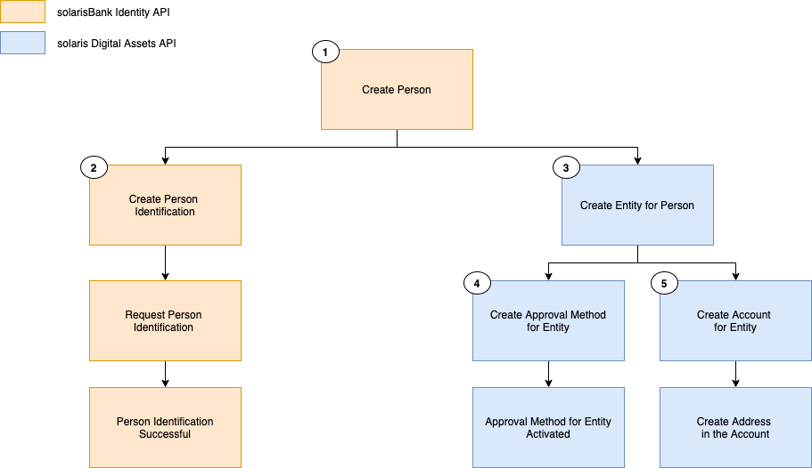
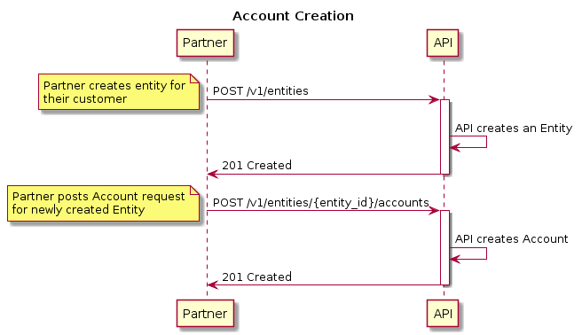
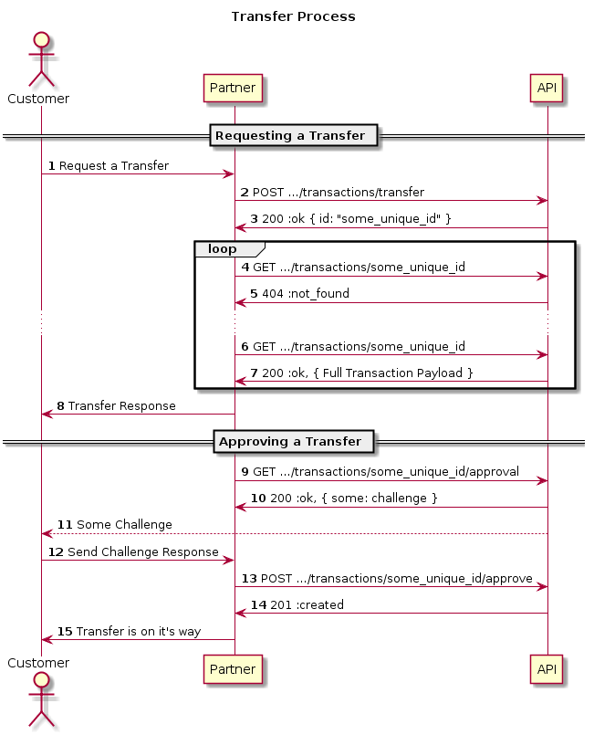

# Solaris Digital Assets Platform API Guide

An API platform that provides a managed custody solution for storing digital assets.

- Version: [0.26.0]
- Updated: [2022-05-11]

## Table of Contents

- [Solaris Digital Assets Platform API Guide](#solaris-digital-assets-platform-api-guide)
  - [Table of Contents](#table-of-contents)
  - [Introduction](#introduction)
    - [Segregated Account](#segregated-account)
    - [Pooled Account](#pooled-account)
  - [Setup](#setup)
  - [Authentication](#authentication)
    - [Digest Header](#digest-header)
    - [X-Nonce Header](#x-nonce-header)
    - [Signature Header](#signature-header)
    - [Examples](#examples)
  - [Filtering](#filtering)
    - [Examples](#examples-1)
  - [Sorting](#sorting)
    - [Examples](#examples-2)
  - [Pagination](#pagination)
    - [Limit-Offset Pagination](#limit-offset-pagination)
      - [Example](#example)
  - [IDs](#ids)
    - [Example](#example-1)
  - [Assets](#assets)
    - [Assets of type BASE](#assets-of-type-base)
    - [Assets of type TOKEN](#assets-of-type-token)
    - [Assets of type FIAT](#assets-of-type-fiat)
    - [Example](#example-2)
      - [Asset of type BASE](#asset-of-type-base)
      - [Asset of type TOKEN](#asset-of-type-token)
      - [Asset of type FIAT](#asset-of-type-fiat)
  - [Solaris Digital Assets recommendation: End customer onboarding](#solaris-digital-assets-recommendation-end-customer-onboarding)
    - [Solarisbank Identity API](#solarisbank-identity-api)
    - [Solaris Digital Assets API](#solaris-digital-assets-api)
      - [Requirements for the end customer to be able to perform transactions](#requirements-for-the-end-customer-to-be-able-to-perform-transactions)
  - [Entities](#entities)
    - [Entity states](#entity-states)
    - [Example](#example-3)
    - [Terms and Conditions](#terms-and-conditions)
      - [Example](#example-4)
    - [ClosureRequests (Entity and Account Closures)](#closurerequests-entity-and-account-closures)
      - [Reason: `CUSTOMER_WISH`](#reason-customer_wish)
        - [Example](#example-5)
      - [Reason: `COMPLIANCE_IMMEDIATE_INTERNAL`](#reason-compliance_immediate_internal)
        - [Example](#example-6)
      - [Reason: `ORDINARY_INTERNAL`](#reason-ordinary_internal)
        - [Example](#example-7)
  - [Accounts](#accounts)
    - [Pooled Accounts (default)](#pooled-accounts-default)
    - [Segregated Accounts](#segregated-accounts)
    - [Account Balance](#account-balance)
    - [Account Available Balance](#account-available-balance)
    - [Account type](#account-type)
      - [Example](#example-8)
  - [Addresses](#addresses)
    - [Example](#example-9)
  - [Transactions](#transactions)
    - [Example](#example-10)
    - [Transaction Processing Workflow](#transaction-processing-workflow)
  - [Deposits](#deposits)
    - [Token Deposits](#token-deposits)
      - [Example](#example-11)
  - [Withdrawals](#withdrawals)
    - [Withdrawal Fee Model](#withdrawal-fee-model)
    - [Withdrawals from TOKEN Accounts](#withdrawals-from-token-accounts)
    - [Processing a Withdrawal](#processing-a-withdrawal)
    - [Example](#example-12)
    - [Example setting an end_to_end_id](#example-setting-an-end_to_end_id)
  - [Transfers](#transfers)
    - [Processing a Transfer](#processing-a-transfer)
    - [Example](#example-13)
    - [Example setting an end_to_end_id](#example-setting-an-end_to_end_id-1)
  - [Canceling a Transaction](#canceling-a-transaction)
    - [Example](#example-14)
  - [ApprovalMethods](#approvalmethods)
    - [Authy push notifications](#authy-push-notifications)
      - [Setup](#setup-1)
      - [Register this ApprovalMethod for an Entity](#register-this-approvalmethod-for-an-entity)
      - [Activation](#activation)
    - [SMS](#sms)
      - [Setup](#setup-2)
      - [Register this ApprovalMethod for an Entity](#register-this-approvalmethod-for-an-entity-1)
      - [Activation](#activation-1)
    - [DSA_ED25519](#dsa_ed25519)
      - [Setup](#setup-3)
      - [Register this ApprovalMethod for an Entity](#register-this-approvalmethod-for-an-entity-2)
      - [Activation](#activation-2)
    - [GROUP](#group)
      - [Setup](#setup-4)
  - [ApprovalRequests](#approvalrequests)
    - [ApprovalMethod: AUTHY_PUSH](#approvalmethod-authy_push)
      - [Setup](#setup-5)
      - [Challenge](#challenge)
      - [Fetching the state of the ApprovalRequest](#fetching-the-state-of-the-approvalrequest)
    - [ApprovalMethod: SMS](#approvalmethod-sms)
      - [Setup](#setup-6)
      - [Challenge](#challenge-1)
      - [Response](#response)
      - [Fetching the state of the ApprovalRequest](#fetching-the-state-of-the-approvalrequest-1)
    - [Approval method: DSA_ED25519](#approval-method-dsa_ed25519)
      - [Setup](#setup-7)
      - [Challenge](#challenge-2)
        - [Example](#example-15)
      - [Response](#response-1)
        - [Example](#example-16)
    - [ApprovalMethod: GROUP](#approvalmethod-group)
      - [Setup](#setup-8)
      - [Creating an ApprovalRequest of type GROUP](#creating-an-approvalrequest-of-type-group)
      - [Requesting approval by members of the ApprovalGroup](#requesting-approval-by-members-of-the-approvalgroup)
  - [Ledger Entries](#ledger-entries)
    - [Example](#example-17)
  - [Callbacks](#callbacks)
    - [Example](#example-18)

## Introduction

The Solaris Digital Assets Platform API is designed to allow partners to store digital asset funds on the platform, accept deposits, process withdrawals and keep track of balances in digital assets.

The partner can own a collection of Accounts on our platform, where each Account holds the funds owned by an Entity of a partner for some specific digital asset. There are two types of Accounts:

- Segregated Account
- Pooled Account

### Segregated Account

All the funds in the Account belong to Entity, which represents an end customer or the partner themselves.

The partner can create one Address associated with a `SEGREGATED` Account, which can be used to deposit funds there.

The partner can initiate Withdrawals to an external address, within the existing Account balance.

### Pooled Account

All the funds in `POOLED` Accounts are treated by the platform as a single pool. There is no seperation between funds and balances of individual customers on the blockchain level.

The partner controls and can register Entities on our platform, which represent end customers or the partner themselves as Account holders.

The partner can register many Accounts in our platform, each Account must be associated with a registered Entity.

The partner can create Addresses associated with an Account, which can be used to deposit funds there.

The partner can initiate Withdrawals to an external address or Transfers to a different Account from an Account on behalf of the Account holder, within the existing Account balance.

## Setup

Before a partner can use the Solaris Digital Assets Platform API we register them in our system. This happens completely on our side and is not exposed by API endpoints.

During this process we are going to create a partner Entity. This Entity can then be used by the partner to authorise Transactions from Accounts the partner owns.

The next step is to create a key pair that is going to be used by the partner to access the API. This happens on partner side, then the partner sends us the public key part. At no point the Solaris Digital Assets Platform platform learns the corresponding private key.

The Private key is used by the partner to sign every API request and the public key is used by Solaris Digital Assets' API to verify the ownership and integrity of the request. We will provide additional instructions on how to generate key pairs combined with authentication code examples as separate document guide.

Finally we register the public key received from the partner, after which the partner can access the API.

## Authentication

We require our partners to generate a pair of private & public keys.
Partners MUST register the public key with the Platform and sign every request to our API
using their private key.

We are using _HTTP Signatures_ IETF draft as the base for our authentication mechanism.
As the digital signature algorithm in HTTP Signatures we are using _Ed25519_.

Every HTTP request to the API MUST have following headers in addition to
standard ones:

- Digest
- X-Nonce
- Signature

### Digest Header

The `Digest` header ensures integrity of the HTTP request body. It MUST be constructed
following the HTTP Instance Digests RFC using SHA-256 algorithm.

In case of GET request, the `Digest` header still must be constructed, assuming the request
body is an empty string.

See:

- Instance Digests in HTTP <https://tools.ietf.org/html/rfc3230>
- Additional Hash Algorithms for HTTP Instance Digests <https://tools.ietf.org/html/rfc5843>

Example:

```
Digest: SHA-256=X48E9qOokqqrvdts8nOJRJN3OWDUoyWxBf7kbu9DBPE=
```

### X-Nonce Header

The `X-Nonce` header is supposed to uniquely identify the HTTP request
and serves to protect against replay/playback attacks.
The `X-Nonce` header value MUST be a string of up to 32 characters,
which MUST be unique across all the requests generated using the same
API key.

As an example, `X-Nonce` header value may be generated as 16-bytes
random integer in hexadecimal representation.

Example:

```
X-Nonce: 514bdd41b15f6b1a0443f8c673adc9db
```

### Signature Header

Signature Header string is used to provide authentication and integrity assurances
without the need for shared secrets. It also does not require an additional round-trip
in order to authenticate the client and allows the integrity of a message to be verified
independently of the transport.

Signature Parameters:

- **keyId**

  Unique ID which is assigned to the Partner's API key.

- **algorithm**

  The value for the `algorithm` parameter MUST be `"hs2019"`.

- **created**

  The value of the `created` parameter MUST be the time at which
  the HTTP request was constructed as an integer Unix timestamp.

- **headers**

  The `headers` parameter identifies how the canonical Signature String is constructed.
  Its value consists of a list of actual and pseudo- HTTP headers which will form
  the Signature String according to the HTTP Signatures draft v11.

  The `headers` parameter MUST include following
  headers: `(request-target)`, `(created)`, `digest`, `x-nonce`.

  The recommended value of the `headers` parameter is:
  `(request-target) (created) digest x-nonce`.

  See:

  - Signature String Construction
    <https://tools.ietf.org/html/draft-cavage-http-signatures-11#section-2.3>

  Example of Signature String for `headers="(request-target) (created) digest x-nonce"`:

  ```

  (request-target): get /foo?bar=123\n
  (created): 1557855475\n
  digest: SHA-256=47DEQpj8HBSa+/TImW+5JCeuQeRkm5NMpJWZG3hSuFU=\n
  x-nonce: 7c44d38b63f5e398af62d603b1155f5c

  ```

  Here `\n` indicate the ASCII newline character. Note the absence of it on the last line.

- **signature**

  The value of the `signature` parameter is the digital signature of the HTTP request produced
  by the partner's private key.

  In order to create the `signature` parameter:

  - Construct the canonical Signature String according to the value of the `headers` parameter
  - Using the private key that corresponds to the provided `keyId` generate an Ed25519
    signature of the Signature String obtained on a previous step
  - Base64-encode the signature

### Examples

```
POST /foo/bar
Digest: SHA-256=X48E9qOokqqrvdts8nOJRJN3OWDUoyWxBf7kbu9DBPE=
X-Nonce: 514bdd41b15f6b1a0443f8c673adc9db
Signature: keyId="foobar",algorithm="hs2019",created=1557855475,headers="(request-target) (created) digest x-nonce",signature="IKGyxGiUFm3luudWGkTzf0TYQD2Fnkb6ed6BTfuXuDq/U9q6gQk6KxBSPx33ME1O2RLlH5HKG2WZnO8PgRGiDA=="

{"hello": "world"}
```

```
GET /foo?bar=123
Digest: SHA-256=47DEQpj8HBSa+/TImW+5JCeuQeRkm5NMpJWZG3hSuFU=
X-Nonce: 7c44d38b63f5e398af62d603b1155f5c
Signature: keyId="foobar",algorithm="hs2019",created=1557855475,headers="(request-target) (created) digest x-nonce",signature="d0Wzjlpt2Y++DJtxKnD1ipkkwF5eU43jwtybqsy3tFqa5P3kYYIJa4TTQyMUZ62i58jwN7gK6q2MVJBDGQ6tDg=="
```

See:

- HTTP Signatures, <https://tools.ietf.org/html/draft-cavage-http-signatures-11>
- Ed25519, <https://ed25519.cr.yp.to/>

## Filtering

Endpoints that list resources support filtering in order to get the desired result set. The filtering scheme supports the following operators:

- Exact match: `filter[state]=COMPLETED`
- Collection range: `filter[state][]=COMPLETED&filter[state][]=FAILED`
- gt(greater than): `filter[starts_at][gt]=2022-01-01T00:00:00Z`
- gte(greater than or equal to): `filter[starts_at][gte]=2022-01-01T00:00:00Z`
- lte(less than or equal to): `filter[starts_at][lte]=2022-01-02T00:00:00Z`
- lt(less than): `filter[starts_at][lt]=2022-01-02T00:00:00Z`

Add the 'filter' parameter to the request query as shown above to use its functionality. Multiple filters can be applied at once by chaining them.

### Examples

- Match single values:

```
GET .../transactions?filter[type]=DEPOSIT

```

```
200 OK

{
  "items": [
    {
      "id": "bf20c716075ea82a4b1f3f0b49657161atrx",
      "account_id": "9c41ec8a82fb99b57cb5078ae0a8b569acct",
      "type": "DEPOSIT",
      "state": "COMPLETED",
      "amount": "1.12340000",
      "fee_amount": "0.00000000",
      "created_at": "2019-04-02T13:15:47Z",
      "updated_at": "2019-04-02T13:15:47Z"
    }
  ]
}
```

- Match any value in a set:

```
GET .../transactions?filter[state][]=COMPLETED&filter[state][]=FAILED

```

```
200 OK

{
  "items": [
    {
      "id": "bf20c716075ea82a4b1f3f0b49657161atrx",
      "account_id": "9c41ec8a82fb99b57cb5078ae0a8b569acct",
      "type": "DEPOSIT",
      "state": "COMPLETED",
      "amount": "1.12340000",
      "fee_amount": "0.00000000",
      "created_at": "2019-04-02T13:15:47Z",
      "updated_at": "2019-04-02T13:15:47Z"
    }
  ]
}
```

- A time range:

```
GET .../transactions?filter[created_at][gte]=2022-01-01T00:00:00Z&filter[created_at][lt]=2022-01-02T00:00:00Z

```

```
200 OK

{
  "items": [
    {
      "id": "944eed5b06bc80a9cae92154fb78425catrx",
      "account_id": "721263078f2dcea6d7fa604aba51e90eacct",
      "type": "DEPOSIT",
      "state": "COMPLETED",
      "amount": "0.01000000",
      "fee_amount": "0.00000000",
      "created_at": "2022-01-01T13:20:54Z",
      "updated_at": "2022-01-01T13:21:00Z"
    }
  ]
}
```

- Combine multiple filters:

```
GET .../transactions?filter[state][]=COMPLETED&filter[state][]=FAILED&filter[type]=DEPOSIT

```

```
200 OK

{
  "items": [
    {
      "id": "bf20c716075ea82a4b1f3f0b49657161atrx",
      "account_id": "9c41ec8a82fb99b57cb5078ae0a8b569acct",
      "type": "DEPOSIT",
      "state": "COMPLETED",
      "amount": "1.12340000",
      "fee_amount": "0.00000000",
      "created_at": "2019-04-02T13:15:47Z",
      "updated_at": "2019-04-02T13:15:47Z"
    }
  ]
}
```

## Sorting

Endpoints that list resources support sorting of the result. In order to sort a result set you must add to the
request the `sort` query parameter and set it's values using array notation: `sort[]=$SORT_STRING` where `$SORT_STRING` is: `$ATTRIBUTE $DIRECTION`,

By default resources are ordered by `created_at desc` and `id asc`.

### Examples

```
GET .../transactions?sort[]=created_at%20desc
```

```
200 OK

{
  "items": [
    {
      "id": "bf20c716075ea82a4b1f3f0b49657161atrx",
      "account_id": "9c41ec8a82fb99b57cb5078ae0a8b569acct",
      "type": "DEPOSIT",
      "state": "COMPLETED",
      "amount": "1.12340000",
      "fee_amount": "0.00000000",
      "created_at": "2020-10-09T13:15:47Z",
      "updated_at": "2020-10-09T13:15:47Z"
    },
    {
      "id": "bf20c716075ea82a4b1f3v0b49a57182atrx",
      "account_id": "9c41ec8a82fb99b57cb5078ae0a8b569acct",
      "type": "DEPOSIT",
      "state": "COMPLETED",
      "amount": "1.00010000",
      "fee_amount": "0.00000000",
      "created_at": "2020-10-01T11:17:47Z",
      "updated_at": "2020-10-01T11:17:47Z"
    }
  ]
}
```

```
GET .../transactions?sort[]=created_at%20desc&sort[]=state%20desc
```

```
200 OK

{
  "items": [
    {
      "id": "bf20c716075ea82a4b1f3f0b49657161atrx",
      "account_id": "9c41ec8a82fb99b57cb5078ae0a8b569acct",
      "type": "DEPOSIT",
      "state": "COMPLETED",
      "amount": "1.12340000",
      "fee_amount": "0.00000000",
      "created_at": "2020-10-09T13:15:47Z",
      "updated_at": "2020-10-09T13:15:47Z"
    },
    {
      "id": "bf20c716075ea82a4b1f3v0b49a57182atrx",
      "account_id": "9c41ec8a82fb99b57cb5078ae0a8b569acct",
      "type": "DEPOSIT",
      "state": "COMPLETED",
      "amount": "1.00010000",
      "fee_amount": "0.00000000",
      "created_at": "2020-10-01T11:17:47Z",
      "updated_at": "2020-10-01T11:17:47Z"
    }
  ]
}
```

## Pagination

Endpoints that list resources support pagination. At the moment we only support Limit-Offset pagination,
but we plan to also support Cursor based pagination in the future.

### Limit-Offset Pagination

In order to paginate resources you must use the parameters `pagination[page]` and `pagination[size]`, both of which must
have integer values, the default value for `pagination[size]` when no value is passed is `100`.

When requesting a paginated result the response will contain a `pagination` object which will
include the values for the next page (`next`) and the previous (`prev`), when such a page is not
available the value will be `nil`.

Limit-Offset pagination can be used in combination with sorting and filtering when needed.

#### Example

```
GET .../transactions?pagination[page]=1&pagination[size]=200
```

```
200 OK

{
  "items": [
    {
      "id": "bf20c716075ea82a4b1f3f0b49657161atrx",
      "account_id": "9c41ec8a82fb99b57cb5078ae0a8b569acct",
      "type": "DEPOSIT",
      "state": "COMPLETED",
      "amount": "1.12340000",
      "fee_amount": "0.00000000",
      "created_at": "2020-10-09T13:15:47Z",
      "updated_at": "2020-10-09T13:15:47Z"
    },
    {
      "id": "bf20c716075ea82a4b1f3v0b49a57182atrx",
      "account_id": "9c41ec8a82fb99b57cb5078ae0a8b569acct",
      "type": "DEPOSIT",
      "state": "COMPLETED",
      "amount": "1.00010000",
      "fee_amount": "0.00000000",
      "created_at": "2020-10-01T11:17:47Z",
      "updated_at": "2020-10-01T11:17:47Z"
    }
  ],
  "pagination": {
    "next": 2,
    "prev": null
  }
}
```

## IDs

All resources exposed by the API have uniform unique ID scheme, which follows the scheme of Solarisbank API — an ID is a String of 36 characters.

### Example

```
{
  "person_id": "5b1c711ef5cf4b7012b688616ed052d3cper"
}
```

## Assets

An Asset in our system represents a single digital asset of some kind. This can be a cryptocurrency (e.g. Bitcoin), a token (ERC20) or some other type of asset.

Any Asset has an artificial unique identifier and some additional details. For example, an ISO currency code equivalent, a human readable description, and other individual properties of an asset like the amounts precision or the address validation rules.

The Asset identifiers are the only way to refer a specific asset on our platform. Any other forms of reference, like an ISO code, are not considered immutable and/or unique.

Assets come in three different types: `BASE`, `TOKEN` and `FIAT`.

### Assets of type BASE

Assets of this type represent crypto assets that are native to their own blockchain like Bitcoin or Ethereum.

### Assets of type TOKEN

Assets of this type represent crypto assets that have been created on an existing blockchain. An example for this are ERC-20 tokens which have been created on the Ethereum blockchain.

Assets of this type always have a `base_asset_id` which is the ID of the Asset that represents the underlying blockchain.

### Assets of type FIAT

Assets of this type represent fiat assets. An example is Euro. Those Assets are only used as a reference Asset for fiat currencies in trading pairs and have only an informative purpose.

No Accounts can be created for Assets of this type.

The API provides a way to list all Assets supported by the platform:

See:

```
GET /v1/assets
GET /v1/assets/{asset_id}
```

### Example

#### Asset of type BASE

```
GET /v1/assets/00000000000000000000000000000001asst
```

```
200 OK

{
  "id": "00000000000000000000000000000001asst",
  "code": "BTC",
  "precision": 8,
  "description": "Bitcoin",
  "address_validation": "^(bc(0([ac-hj-np-z02-9]{39}|[ac-hj-np-z02-9]{59})|1[ac-hj-np-z02-9]{8,87})|[13][a-km-zA-HJ-NP-Z1-9]{25,35})$",
  "tx_min_amount": "0.00001",
  "type":"BASE",
  "created_at": "2019-01-17T17:05:44Z"
  "updated_at": "2019-01-17T17:05:44Z"
}
```

#### Asset of type TOKEN

```
GET /v1/assets/00010000000000000000000000000002asst
```

```
200 OK

{
  "id": "00010000000000000000000000000002asst",
  "base_asset_id":"00000000000000000000000000000002asst,
  "code": "TKN",
  "precision": 6,
  "description": "A token based on ETH",
  "address_validation": "^(bc(0([ac-hj-np-z02-9]{39}|[ac-hj-np-z02-9]{59})|1[ac-hj-np-z02-9]{8,87})|[13][a-km-zA-HJ-NP-Z1-9]{25,35})$",
  "tx_min_amount": "0.001",
  "type":"TOKEN",
  "created_at": "2019-01-17T17:05:44Z"
  "updated_at": "2019-01-17T17:05:44Z"
}
```

#### Asset of type FIAT

```
{
  "id": "f0000000000000000000000000000001asst",
  "type": "FIAT",
  "code": "EUR",
  "precision": 2,
  "description": "Euro",
  "address_validation": null,
  "tx_min_amount": "30.0",
  "created_at": "2020-11-24T12:56:55Z",
  "updated_at": "2020-11-24T12:57:09Z"
}
```

## Solaris Digital Assets recommendation: End customer onboarding

Before a partner can offer their customers the full feature set of Solaris Digital Assets' API, the partner must onboard the customer. We recommend the following steps to fully onboard the customer:

### Solarisbank Identity API

1. Partner should [create a person](https://docs.solarisbank.com/core/api/v1/#44qZGy7K-post-create-a-person) (end customer of Partner)
2. Partner should [create an identification](https://docs.solarisbank.com/core/api/v1/#6Q8p3mGx-person-identification) for the person with a selected method

- Once the identification has been created, Partner should request an identification link for the respective end customer by fetching a dedicated URL
- Identification needs to be completed successfully. Should an identification not reach a final status, the existing link can be reused.

### Solaris Digital Assets API

1. Partner should create an Entity for the person (see: Entity)
2. Partner should create an approval method for the Entity (see: ApprovalMethods)

- ApprovalMethod should be activated by the Entity

3. Partner should create an Account for the Entity (see: Accounts)

- Partner should create an Address for the Account (see: Addresses)

> NOTE: The order above is just Solaris Digital Assets' recommendation. Creating a Person is a prerequisite to further develop on top of Solaris Digital Assets' API.
> Certain functionalities, like creating Account and Addresses is possible without successful KYC of an end customer. Although, for example in an event of a detected
> Deposit, funds will never be unlocked until the KYC has been successfully completed. Hence, Withdrawals or Transfers will be not possible either.

#### Requirements for the end customer to be able to perform transactions

- Person created (sB Identity API)
- KYC successfully completed (sB Identity API)
- Entity created (SDA API)
- Approval method successfully created and verified for the entity (SDA API)
- Account and associated address created (SDA API)



## Entities

During the setup phase we only create one Entity of type `PARTNER`, which represents the partner as an Account holder.

To be able to create Accounts on behalf of end customers, the partner MUST beforehand create corresponding Entities of type `PERSON`. During this process the partner MUST provide a `person_id` — a unique identifier of an individual provided by Solarisbank KYC product.

Entities of type `REPRESENTATIVE_PERSON` represent Entities which can approve ApprovalRequests on a
Transaction which belongs to another Entity. Several Entities of type `REPRESENTATIVE_PERSON` can have the same `person_id` as long as that
`person_id` is not in use by another Entity of type `PERSON`.

### Entity states

Entities can have multiple states which are:

`ACTIVE` - The Entity can use the platform without restrictions.
`CLOSING` - A ClosureRequest has been created for the Entity; awaiting confirmation by the partner.
`LEGALLY_CLOSED` – The contractual relationship between SDA and the customer has ended, the customer can still withdraw their remaining funds.
`CLOSED` – The contractual relationship between SDA and the customer has ended. This customer can not use any functionality of the platform.

See:

```
POST /v1/entities
GET /v1/entities
GET /v1/entities/{entity_id}
```

### Example

Creating Entity of type `PERSON`

```
POST /v1/entities

{
  "type": "PERSON",
  "person_id": "5b1c711ef5cf4b7012b688616ed052d3cper"
}
```

```
201 Created

{
  "id": "10ef67dc895d6c19c273b1ffba0c1692enty",
  "type": "PERSON",
  "person_id": "5b1c711ef5cf4b7012b688616ed052d3cper",
  "terms_conditions_signed_at": null,
  "state": "ACTIVE",
  "legally_closed_at": null,
  "closed_at": null,
  "created_at": "2019-04-02T12:27:33Z",
  "updated_at": "2019-04-02T12:27:33Z",
}
```

Creating Entity of type `BUSINESS`

```
POST /v1/entities

{
  "type": "BUSINESS",
  "name": "Mustermann GmbH",
  "business_id": "880bbac68a34add190786b9c74f4c82fcbiz""
}
```

```
201 Created

{
  "id": "10ef67dc895d6c19c273b1ffba0c1692enty",
  "type": "BUSINESS",
  "name": "Mustermann GmbH",
  "business_id": "880bbac68a34add190786b9c74f4c82fcbiz""
  "terms_conditions_signed_at": null,
  "created_at": "2019-04-02T12:27:33Z",
  "updated_at": "2019-04-02T12:27:33Z",
}
```

### Terms and Conditions

Entities of type `PERSON` and `BUSINESS` are required to accept SDA's terms and conditions in order to use the platform. This is done by issuing a POST requests to `/v1/entities/{entity_id}/terms_and_conditions`.
It is the partner's responsibility to present SDA's terms and conditions to the customer. The partner MUST NOT call this endpoint otherwise.

See:

```
POST /v1/entities/{entity_id}/terms_and_conditions
```

#### Example

```
POST /v1/entities/10ef67dc895d6c19c273b1ffba0c1692enty/terms_and_conditions
```

### ClosureRequests (Entity and Account Closures)

The contractual relationship between a customer and Solaris Digital Assets can be terminated by both parties.
To initiate the termination of the contract, a ClosureRequest must be created by the initiating party. This ClosureRequest
represents the processing of the termination. A ClosureRequest has a lifecycle and will traverse through multiple states.

A ClosureRequest starts in state `PENDING` directly after initialization:

- ClosureRequests of type `COMPLIANCE_IMMEDIATE_INTERNAL` will transition to state `PROCESSING` once the partner has confirmed
- ClosureRequests of type `CUSTOMER_WISH` will transition immediately to state `PROCESSING`
- ClosureRequests of type `ORDINARY_INTERNAL` will transition to state `APPROVED` once the partner has confirmed, after 60 days the ClosureRequests transition to state `PROCESSING`

ClosureRequests in state `PROCESSING`, and once processed, the ClosureRequests will reach their final state: `COMPLETED`. After a ClosureRequest has been completed, the contractual relationship between Solaris Digital Assets and the customer has ended. Solaris Digital Assets will then stop to offer it's services to this customer. I.e. the customer's Accounts can not be used anymore.

The creation of a ClosureRequest can fail, e.g. when there already is an existing ClosureRequest for this customer. In this case the ClosureRequest's
state will be `FAILED`.

ClosureRequests can have different `reasons` depending on which party initiates the termination of the contract and under which circumstances the contract is
terminated. Only ClosureRequests of `reason: CUSTOMER_WISH` can be created by a partner.

After a ClosureRequest has been created the customer will have 30 days for `CUSTOMER_WISH` & `COMPLIANCE_IMMEDIATE_INTERNAL` reasons and 90 days for `ORDINARY_INTERNAL` reason to withdraw their Assets from their Accounts.

To withdraw full balance of the Account there are 2 options:

1. Create a withdrawal with `total_amount` attribute which equals the full balance of the Account. The transacted amount will equals `total_amount` minus `fee_amount` (Example: Withdraw 1 BTC. Fee computed at 0.01 BTC. Withdrawal leaves 0 BTC in the Account. The end customer receives 0.99 BTC in the external wallet)
2. Create a withdrawal with `amount` attribute which equals the full balance of the Account and specify a different fee paying account by `fee_account_id` attribute. The transacted amount will equal the full balance of the Account (Example: Withdraw 1 BTC. Fee computed at 0.01 BTC. Withdrawal leaves 0 BTC in the Account. The end customer receives 1 BTC in the external wallet. The fee is deducted from a different Account that belongs to the same Partner)

#### Reason: `CUSTOMER_WISH`

An end customer can end their contractual relationship with Solaris Digital Assets. To enable end customers to do that, our API offers endpoints for requesting, listing and showing ClosureRequests.

After a ClosureRequest has been submitted the customer will have 30 days to withdraw their Assets from their Accounts.

See:

```
POST /v1/entities/{entity_id}/closure_requests
GET /v1/entities/{entity_id}/closure_requests
GET /v1/entities/{entity_id}/closure_requests/{closure_request_id}
```

##### Example

Creating a ClosureRequest: `CUSTOMER_WISH`

```
POST /v1/entities/5a991ba917c829ca2ab6ce9a4ee3f9fcenty/closure_requests

{
  "reason": "CUSTOMER_WISH"
}

```

```
201 Created

{
  "id": "6138143133c91f3235a108d31dc90805creq",
  "entity_id": "5a991ba917c829ca2ab6ce9a4ee3f9fcenty",
  "reason": "CUSTOMER_WISH",
  "state": "PROCESSING",
  "valid_until": "2021-01-01T12:35:38Z",
  "created_at": "2020-12-02T12:35:38Z",
  "updated_at": "2020-12-02T12:35:38Z"
}
```

#### Reason: `COMPLIANCE_IMMEDIATE_INTERNAL`

A platform's compliance officer can initiate the end of of the platform's relationship with the end customer. After the compliance officer has
initiated the account closure the partner will receive a callback for a ClosureRequest with reason `COMPLIANCE_IMMEDIATE_INTERNAL` (see: [Callbacks](#callbacks)).

Upon receiving the callback with the ClosureRequest the partner must inform the end customer of the closure, the partner must later confirm to the platform (via API) that the end customer has acknowledged the account closure.

To approve the ClosureRequest:

```
POST /v1/entities/{entity_id}/closure_requests/{closure_request_id}/confirm
```

After a ClosureRequest has been confirmed the customer will have 30 days to withdraw their Assets from their Accounts.

##### Example

```
POST /v1/entities/5a991ba917c829ca2ab6ce9a4ee3f9fcenty/closure_requests/3038143133c91f3235a108d31dc00211creq/confirm

```

```
200 OK

{
  "id": "3038143133c91f3235a108d31dc00211creq",
  "entity_id": "5a991ba917c829ca2ab6ce9a4ee3f9fcenty",
  "reason": "COMPLIANCE_IMMEDIATE_INTERNAL",
  "state": "PROCESSING",
  "valid_until": "2021-01-01T12:35:38Z",
  "created_at": "2020-12-02T12:35:38Z",
  "updated_at": "2020-12-02T12:35:38Z"
}
```

#### Reason: `ORDINARY_INTERNAL`

A platform's compliance, customer support or seizures officer can initiate the end of of the platform's relationship with the end customer. After the account closure has been
initiated, the partner will receive a callback for a ClosureRequest with reason `ORDINARY_INTERNAL` (see: [Callbacks](#callbacks)).
Upon receiving the callback with the ClosureRequest the partner must inform the end customer of the closure, the partner must later confirm to the platform (via API) that the end customer has acknowledged the account closure.

To approve the ClosureRequest:

```
POST /v1/entities/{entity_id}/closure_requests/{closure_request_id}/confirm
```

After a ClosureRequest has been confirmed the customer will have 90 days to withdraw their Assets from their Accounts.

##### Example

```
POST /v1/entities/5a991ba917c829ca2ab6ce9a4ee3f9fcenty/closure_requests/3038143133c91f3235a108d31dc00211creq/confirm

```

```
200 OK

{
  "id": "3038143133c91f3235a108d31dc00211creq",
  "entity_id": "5a991ba917c829ca2ab6ce9a4ee3f9fcenty",
  "reason": "ORDINARY_INTERNAL",
  "state": "APPROVED",
  "valid_until": "2021-01-01T12:35:38Z",
  "created_at": "2020-12-02T12:35:38Z",
  "updated_at": "2020-12-02T12:35:38Z"
}

```

## Accounts

An Account represents an aggregation of funds attributed to some registered Entity as an Account holder. It can be an end customer or the partner owning an Account. The association between the Account and its owner is permanent.

To create an Account, the partner MUST provide a reference to an existing Entity and the Asset associated for this Account.

Accounts can have different isolation levels, `POOLED` and `SEGREGATED`.

### Pooled Accounts (default)

With Pooled Accounts there is no separation of funds on the blockchain level. Pooled Accounts offer
certain benefits for its users. It is possible to send instant Transfers from all Accounts of one
Asset to other Accounts of the same Asset without touching the blockchain and thus without paying
expensive fees.

Accounts that are created for Assets of type `BASE` must be `POOLED`.

### Segregated Accounts

Segregated Accounts separate funds on the blockchain level. Transfers to other Accounts are not possible.



### Account Balance

The Account resource provided by the API contains the `balance` attribute, which represents
the Account Balance. Accounts start with having a balance of 0.

Every successfully processed Transaction increases or decreases the Account Balance
by creating corresponding Ledger Entries.
As such the Account Balance equals to the sum of all Ledger Entries of this Account.

### Account Available Balance

Whenever a Transaction that transfers funds out of the Account is requested,
for example Withdrawal or Transfer, the Account Balance is not immediately reduced.
It is only when the Transaction is approved by the Customer or the Partner,
and then processed by the platform, the corresponding Account Balance is updated.

At the same time, even though after requesting a Transaction the Account Balance
didn't change, it does not mean that all of it can be spent, as there is a pending
Transaction in the processing pipeline.

To mitigate that and improve user experience, every Account also exposes
the `available_balance` attribute, which represents
the current Account Available Balance.

The Account Available Balance displays how much can be spent by the next requested
Transaction.

### Account type

Accounts have one of two different kinds, depending on the underlying Asset's type.
It is either `BASE` when the Account belongs to a base Asset or `TOKEN` when the
Account belongs to a token Asset.

It is not possible to create Accounts for Assets of type `FIAT`!

See:

```
POST /v1/entities/{entity_id}/accounts
GET /v1/entities/{entity_id}/accounts
GET /v1/entities/{entity_id}/accounts/{account_id}
```

#### Example

```
POST /v1/entities/10ef67dc895d6c19c273b1ffba0c1692enty/accounts

{
  "asset_id": "00000000000000000000000000000001asst"
}
```

```
201 Created

{
  "id": "9c41ec8a82fb99b57cb5078ae0a8b569acct",
  "asset_id": "00000000000000000000000000000001asst",
  "entity_id": "10ef67dc895d6c19c273b1ffba0c1692enty",
  "balance": "0.00000000",
  "available_balance": "0.00000000",
  "isolation": "POOLED",
  "type": "BASE",
  "created_at": "2019-02-02T13:41:34Z",
  "updated_at": "2019-02-02T13:41:34Z"
}
```

## Addresses

An Address represents a blockchain-level digital asset address associated with an Account. This Address can be used to make deposits to the Account.

There can be many Addresses created and associated with an Account, and once created the Addresses stay permanently valid and permanently associated with the Account. This is how we track the ownership of funds deposited to some blockchain-level address.

See:

```
POST /v1/entities/{entity_id}/accounts/{account_id}/addresses
GET /v1/entities/{entity_id}/accounts/{account_id}/addresses
GET /v1/entities/{entity_id}/accounts/{account_id}/addresses/{address_id}
```

### Example

```
POST /v1/entities/10ef67dc895d6c19c273b1ffba0c1692enty/accounts/9c41ec8a82fb99b57cb5078ae0a8b569acct/addresses

{}
```

```
201 Created

{
  "id": "42049cb01a6962d0232223e632aac68baddr",
  "account_id": "9c41ec8a82fb99b57cb5078ae0a8b569acct",
  "address": "1F1tAaz5x1HUXrCNLbtMDqcw6o5GNn4xqX",
  "created_at": "2019-02-02T13:43:34Z",
  "updated_at": "2019-02-02T13:43:34Z"
}
```

## Transactions

A Transaction represents an operation that affected the balance of the Account.

Transactions have a `type` attribute, which describes the operation:

- DEPOSIT
- WITHDRAWAL
- WITHDRAWAL_FEE
- TRANSFER_OUTGOING
- TRANSFER_INCOMING

In addition Transactions have the following attributes:

| name           | type    | desc                                              |
| -------------- | ------- | ------------------------------------------------- |
| account_id     | String  | ID of the account tx belongs to                   |
| state          | String  | State of the tx, e.g. "PENDING"                   |
| amount         | Decimal | Transacted amount, positive or negative           |
| fee_amount     | Decimal | Charged fee, always positive or 0                 |
| fee_account_id | String  | ID of the account from which the fee is collected |

Other attributes may be present, depending on the type of Transaction.

See:

```
GET /v1/entities/{entity_id}/accounts/{account_id}/transactions
GET /v1/entities/{entity_id}/accounts/{account_id}/transactions/{transaction_id}
```

### Example

```
GET /v1/entities/10ef67dc895d6c19c273b1ffba0c1692enty/accounts/9c41ec8a82fb99b57cb5078ae0a8b569acct/transactions
```

```
200 OK

{
  "items": [
    {
      "id": "bf20c716075ea82a4b1f3f0b49657161atrx",
      "account_id": "9c41ec8a82fb99b57cb5078ae0a8b569acct",
      "type": "DEPOSIT",
      "state": "PENDING",
      "amount": "1.12340000",
      "fee_amount": "0.00000000",
      "fee_account_id": "9c41ec8a82fb99b57cb5078ae0a8b569acct",
      "address": "1F1tAaz5x1HUXrCNLbtMDqcw6o5GNn4xqX",
      "blockchain_txid": "0dfd5b293f62780ef18eb85c6cdbbad408217576ac0e4f610d2f7a145a7f8de2",
      "blockchain_output_n": 1,
      "created_at": "2019-04-02T13:15:47Z",
      "updated_at": "2019-04-02T13:15:47Z"
    },
    {
      "id": "4368fe9ac68c3215b2432a6acffddee8atrx",
      "account_id": "9c41ec8a82fb99b57cb5078ae0a8b569acct",
      "type": "WITHDRAWAL",
      "state": "COMPLETED",
      "amount": "-0.80000000",
      "fee_amount": "0.12340000",
      "fee_account_id": "9c41ec8a82fb99b57cb5078ae0a8b569acct",
      "address": "2N7M3hr2d8BDJUX1ttd8oC2a3gZPr8MGo8C",
      "reference": "unique-a8e530db9b0e3ba8-ref",
      "blockchain_txid": "2950ce725f529c5ea6dcedeeceaea7f42a62eeeb81c7da0bb08eb52e0f96d9d6",
      "blockchain_output_n": 0,
      "linked_tx_ids": [
        "1556f5f4fa23e81e6bbdc313fa1707f5atrx"
      ],
      "created_at": "2019-04-02T13:18:51Z",
      "updated_at": "2019-04-02T13:18:51Z"
    },
    {
      "id": "1556f5f4fa23e81e6bbdc313fa1707f5atrx",
      "account_id": "9c41ec8a82fb99b57cb5078ae0a8b569acct",
      "type": "WITHDRAWAL_FEE",
      "state": "COMPLETED",
      "amount": "0.12340000",
      "fee_amount": "0",
      "fee_account_id": "9c41ec8a82fb99b57cb5078ae0a8b569acct",
      "linked_tx_ids": [
        "4368fe9ac68c3215b2432a6acffddee8atrx"
      ],
      "created_at": "2019-04-02T13:18:51Z",
      "updated_at": "2019-04-02T13:18:51Z"
    },
    {
      "id": "27341700f516438c28632e8d973a6c59atrx",
      "account_id": "9c41ec8a82fb99b57cb5078ae0a8b569acct",
      "type": "TRANSFER_OUTGOING",
      "state": "COMPLETED",
      "amount": "-0.50000000",
      "fee_amount": "0.00000000",
      "fee_account_id": "9c41ec8a82fb99b57cb5078ae0a8b569acct",
      "reference": "example of reference",
      "sender_account_id": "9c41ec8a82fb99b57cb5078ae0a8b569acct",
      "receiver_account_id": "f0cfb103e6c3d4a37c2750a1256862a3acct",
      "created_at": "2019-04-02T13:18:51Z",
      "updated_at": "2019-04-02T13:18:51Z"
    }
  ]
}
```

### Transaction Processing Workflow

Each Transaction has a "state" attribute, that can take any value of:

- PENDING
- APPROVED
- COMPLETED
- FAILED
- CANCELLED

Whenever a Transaction is created, it starts in a PENDING state.

Before the Transaction can be processed by the Platform, the initiator of Transaction
MUST approve it. For the Transactions requested by the partner, i.e. a Withdrawal or a Transfer,
it should be the corresponding Account holder. Other Transaction types are automatically created
and approved by the Platform, in response to some external events, e.g. a Deposit is created
whenever a blockchain transaction is spotted on the network, and it is approved
whenever the blockchain transaction is sufficiently confirmed.

A Transaction in APPROVED state means that the initiator of the Transaction has approved it,
and the Transaction is accepted for processing by the Platform. Depending on the type of
Transaction, it can stay in this state for a significant amount of time, for example:

- processing of the Transaction can be naturally delayed, as in the case of batching
  of multiple Withdrawals
- performing Compliance checks can delay a Transaction

COMPLETED state means that the Transaction has been successfully processed, and the Account
balance has been updated. This state is final.

> NOTE: It's up to partner how to present the Transaction states to the end customer. An important
> distinction would be that both PENDING and APPROVED states mean that the Transaction
> is still being processed, and only COMPLETED state means the Transaction is finalized.

In case of a failure that prevents the Transaction from being successfully processed,
a Transaction can transition to FAILED state. Any amount which was locked
by such Transaction will be released, and the Account's available balance will be updated.
The FAILED state is final.

Before the transaction is APPROVED a partner can choose to CANCEL a transaction, the transaction will then transition to the CANCELLED state. Any amount which was locked by such Transaction will be released, and the Account Available balance will be updated. This state is final.

Whenever a Transaction is requested by the partner, the platform runs validation checks on this request:

| Validation check | Description                                                                                     |
| ---------------- | ----------------------------------------------------------------------------------------------- |
| Amount Precision | Precision of transacted/credited/debited amount needs to be within the range of Asset Precision |
| Min Amount       | Minimal amount allowed for outgoing transactions in this Asset                                  |
| Address Format   | Soft validation with Asset specified RegExp                                                     |

If any of these checks fail, the Partner will see error response with code 400 **Invalid request**:

```json
{
  "message": "Invalid request",
  "params": {
    "address": "invalid"
  }
}
```

If other validation checks fail then a Transaction will be created and immediately
set to FAILED state. This can happen, for example, when the corresponding Account
does not have sufficient balance to process this Transaction.

## Deposits

A Deposit is a Transaction of type DEPOSIT. A Deposit represents a single incoming blockchain-level transfer to some Account Address.

Whenever a blockchain transaction is made to one of the addresses created using the API, the sequence is following:

- The transaction is first detected on the network and is registered on the platform as a new Transaction of type DEPOSIT
- The partner can then see the Deposit in the list of Account Transactions and start tracking its state
- The transaction is confirmed by the network and the corresponding Transaction of type DEPOSIT state is changed on the platform, crediting the funds
- The partner can detect the state change by polling for the individual Transaction details or by listing the Account Transactions

### Token Deposits

On the blockchain level tokens can be received on Addresses of the underlying asset.
To register token deposits that have been sent to the Address of the underlying asset
(on the Solaris Digital Assets platform) a token Account MUST be created.

Once a token Account has been created, existing Addresses of the base Account can receive
token Deposits and all token Deposits for this Asset that happened before the creation
of the Account will be visible to the Partner.

#### Example

```
GET /v1/entities/10ef67dc895d6c19c273b1ffba0c1692enty/accounts/9c41ec8a82fb99b57cb5078ae0a8b569acct/transactions/bf20c716075ea82a4b1f3f0b49657161atrx
```

```
200 OK

{
  "id": "bf20c716075ea82a4b1f3f0b49657161atrx",
  "account_id": "9c41ec8a82fb99b57cb5078ae0a8b569acct",
  "type": "DEPOSIT",
  "state": "PENDING",
  "amount": "1.12340000",
  "fee_amount": "0.00000000",
  "fee_account_id": "9c41ec8a82fb99b57cb5078ae0a8b569acct",
  "address": "1F1tAaz5x1HUXrCNLbtMDqcw6o5GNn4xqX",
  "blockchain_txid": "0dfd5b293f62780ef18eb85c6cdbbad408217576ac0e4f610d2f7a145a7f8de2",
  "blockchain_output_n": 1,
  "created_at": "2019-04-02T13:15:47Z",
  "updated_at": "2019-04-02T13:15:47Z"
}
```

## Withdrawals

A Withdrawal is a Transaction of type WITHDRAWAL. A Withdrawal represents a single transfer of funds from an Account to some external blockchain-level address.

### Withdrawal Fee Model

The SDA platform offers a flexible solution for paying blockchain fees. When creating a Withdrawal the partner can specify an Account that pays the fees for this Withdrawal.
This can either be the Account from which the Withdrawal originates from, or any other Account the partner's Entity owns. This allows the partner to pay the fees for the
customer, if he chooses to do so.

As a default the originating Account of the Withdrawal is used. In case the originating Account is a TOKEN Account, the default is the corresponding BASE Account.

For Withdrawals in Assets of type `TOKEN` the specified fee Account must belong to the corresponding Asset of type `BASE`.

The platform will charge the specified Account. A transaction of type `WITHDRAWAL_FEE` will be created in the originating Account of the Withdrawal.

The platform uses the collected fees to pay for transactions on a blockchain.

### Withdrawals from TOKEN Accounts

Fees for Withdrawals from TOKEN Accounts MUST be paid in the base Asset of said TOKEN Account. The platform will collect these fees from the fee paying Account that has been specified in the Withdrawal or the default fee Account for the originating Account.

### Processing a Withdrawal

To issue a Withdrawal on behalf of the customer, the partner creates a new Withdrawal object and provides a `reference` value, which MUST be unique across all Transactions of this partner and serves as idempotency key.

Additionally the partner can set an optional `end_to_end_id` at the moment of requesting a Withdrawal which can help partners to identify the Transaction, when not set the platform will set one automatically.
The `end_to_end_id` must be a unique string, the string must have a size no larger than 64 characters and all characters must be in the ASCII 7 bit character list.

The Withdrawal is then registered on the platform and validated, after which the customer
(as an Account holder) MUST approve the Withdrawal. See [Transaction Approvals].

Once Withdrawal is validated and approved, the platform proceeds to queueing the Withdrawal for processing.

Periodically multiple Withdrawals are grouped together in a single blockchain-level transaction, which is signed and eventually broadcasted.

After a corresponding blockchain-level transaction is broadcasted on the network,
all included Withdrawals are completed and their blockchain reference attributes are updated.

See:

```
POST /v1/entities/{entity_id}/accounts/{account_id}/transactions/withdrawal
```

### Example

```
POST /v1/entities/10ef67dc895d6c19c273b1ffba0c1692enty/accounts/9c41ec8a82fb99b57cb5078ae0a8b569acct/transactions/withdrawal

{
  "reference": "unique-a8e530db9b0e3ba8-ref",
  "address": "3D2oetdNuZUqQHPJmcMDDHYoqkyNVsFk9r",
  "amount": "1.00000000",
  "fee_account_id": "b4b7525ae27160d582b9a2305aba9e00acct"
}
```

```
201 Created

{
  "transaction_id": "bede420fae7624091f337c22f9714fc0atrx"
}
```

### Example setting an end_to_end_id

```
POST /v1/entities/10ef67dc895d6c19c273b1ffba0c1692enty/accounts/9c41ec8a82fb99b57cb5078ae0a8b569acct/transactions/withdrawal

{
  "reference": "unique-a8e530db9b0e3ba8-ref",
  "address": "3D2oetdNuZUqQHPJmcMDDHYoqkyNVsFk9r",
  "amount": "1.00000000",
  "fee_account_id": "b4b7525ae27160d582b9a2305aba9e00acct",
  "end_to_end_id": "d97fbb01ed496dea646809dd"
}
```

```
201 Created

{
  "transaction_id": "bede420fae7624091f337c22f9714fc0atrx"
}
```

## Transfers

A Transfer represents a transfer of funds from one Account to another Account of the same Asset.
This operation is not reflected externally as a blockchain transaction or any other observable event.
It can be a Transfer between any two `POOLED` Accounts of the same Asset.

On the API level a Transfer is represented as two Transactions, one in the sender Account, having
the type TRANSFER_OUTGOING, and one in the receiver Account, having the type TRANSFER_INCOMING.

### Processing a Transfer

To issue a Transfer on behalf of the Account holder, the partner issues a request to create a Transfer
on the sender Account and provides a `reference` value, which MUST be unique across all Transactions
of this partner and serves as idempotency key.

Additionally the partner can set an optional `end_to_end_id` at the moment of requesting a Transfer.
This `end_to_end_id` will be set to both Outgoing and Incoming Transfer Transactions and can help partner to identify the transactions, when not set the platform will set it automatically.
The `end_to_end_id` must be a unique string, the string must have a size no larger than 64 characters and all characters must be in the ASCII 7 bit character list.

To reference a receiver Account of the Transfer, the partner MUST provide an ID of that Account.

After the Transfer request is validated and a Transfer (Outgoing) Transaction is created
by the platform, the Transaction MUST be approved by the customer (as an Account holder).
See [Transaction Approvals].

A Transaction of type TRANSFER_OUTGOING is created under the originating (sender) Account
debiting the funds, and another Transaction of type TRANSFER_INCOMING crediting the funds
is created in the receiving (receiver) Account, once the corresponding TRANSFER_OUTGOING
Transaction has been completed.



See:

```
POST /v1/entities/{entity_id}/accounts/{account_id}/transactions/transfer
```

### Example

```
POST /v1/entities/10ef67dc895d6c19c273b1ffba0c1692enty/accounts/9c41ec8a82fb99b57cb5078ae0a8b569acct/transactions/transfer

{
  "reference": "unique-32d57e1d72b9b5fa-ref",
  "receiver_account_id": "e0c7cea27569ba4c59572e4073ee823bacct",
  "amount": "1.00000000"
}
```

```
201 Created

{
  "transaction_id": "fd213476ad3a1f2df48c7cbca394f3edatrx",
}
```

### Example setting an end_to_end_id

```
POST /v1/entities/10ef67dc895d6c19c273b1ffba0c1692enty/accounts/9c41ec8a82fb99b57cb5078ae0a8b569acct/transactions/transfer

{
  "reference": "unique-32d57e1d72b9b5fa-ref",
  "receiver_account_id": "e0c7cea27569ba4c59572e4073ee823bacct",
  "amount": "1.00000000",
  "end_to_end_id": "1a37702e42ca8b999b8750655208"
}
```

```
201 Created

{
  "transaction_id": "fd213476ad3a1f2df48c7cbca394f3edatrx",
}
```

## Canceling a Transaction

A transaction of `type` `WITHDRAWAL` or `TRANSFER` can be cancelled by the Partner
given it is still in `PENDING` state.

```
POST /v1/entities/{entity_id}/accounts/{account_id}/transactions/{transaction_id}/cancel
```

### Example

```
POST /v1/entities/10ef67dc895d6c19c273b1ffba0c1692enty/accounts/9c41ec8a82fb99b57cb5078ae0a8b569acct/transactions/bede420fae7624091f337c22f9714fc0atrx/cancel

200 OK

{
  "id": "bede420fae7624091f337c22f9714fc0atrx",
  "account_id": "9c41ec8a82fb99b57cb5078ae0a8b569acct",
  "type": "WITHDRAWAL",
  "state": "CANCELLED",
  "amount": "-0.00000001",
  "fee_amount": "1.00000000",
  "fee_account_id": "9c41ec8a82fb99b57cb5078ae0a8b569acct",
  "address": "1A1zP1eP5QGefi2DMPTfTL5SLmv7DivfNa",
  "reference": "some-reference-ea1ee054",
  "blockchain_txid": null,
  "blockchain_output_n": null,
  "linked_tx_ids": [
    "1556f5f4fa23e81e6bbdc313fa1707f5atrx"
  ],
  "created_at": "2020-09-21T10:47:34Z",
  "updated_at": "2020-09-21T10:47:34Z"
}
```

## ApprovalMethods

ApprovalMethod defines the particular MFA mechanism that the Account holder (Entity) can use
to approve their Transactions.

Currently there are following ApprovalMethod types supported by the platform:

- `AUTHY_PUSH` -- represents a Authy push notifications based MFA
- `SMS` -- represents an SMS message
- `DSA_ED25519` -- represents an ECDSA based MFA mechanism
- `GROUP` -- represents a group of approvers with a quorum

In order to be able to approve Transactions by the corresponding Account holder (an Entity
of type `PERSON`, `PARTNER` or `BUSINESS`), there MUST be a registered and activated ApprovalMethod
for this Entity.

When first registered, an ApprovalMethod is in a `PENDING` state. Then, depending on
ApprovalMethod type, it can be activated by the platform operator or by the customer.

Only the ApprovalMethod in `ACTIVATED` state can be used to approve Transactions.

Currently there can be only one ApprovalMethod of each type registered for an Entity.

See:

```
POST /v1/entities/{entity_id}/approval_methods
GET /v1/entities/{entity_id}/approval_methods
GET /v1/entities/{entity_id}/approval_methods/{approval_method_id}
```

### Authy push notifications

This ApprovalMethod is aimed at customers (individual people) as Account holders,
and can only be registered for Entities of type `PERSON`.

#### Setup

The corresponding Entity of type `PERSON` MUST be registered.

#### Register this ApprovalMethod for an Entity

To register this ApprovalMethod for an Entity, only `type` attribute is required.

Example:

```
POST /v1/entities/df8bd407b3dfbd37f8ff3e5efbd4e8acenty/approval_methods

{
  "type": "AUTHY_PUSH"
}
```

```
201 Created

{
  "id": "b2046aec77bdd03dc0db46e57e0a722bapmt",
  "entity_id": "df8bd407b3dfbd37f8ff3e5efbd4e8acenty",
  "type": "AUTHY_PUSH",
  "state": "PENDING",
  "created_at": "2019-11-03T12:21:16Z",
  "updated_at": "2019-11-03T12:21:16Z"
}
```

#### Activation

Registering an ApprovalMethod of type `AUTHY_PUSH` for an Entity will automatically trigger
this customer's enrollment at Authy service, provided they have successfully completed their KYC
process. If the KYC process for this customer is not complete, the automatic enrollment
at Authy will be delayed until it is.

The activation of this ApprovalMethod is controlled by the customer and may or may not
require additional setup on their part, depending on whether they have already registered
at Authy with the phone number they provided during the KYC process or not.

1. **Customer is already registered at Authy**:
   In case the customer is already registered at Authy with the same phone number they provided
   during the KYC process, there will be a push notification sent to the customer in their Authy app,
   asking/notifying them to add another application.

2. **Customer is not registered at Authy**:
   In case the customer is not registered at Authy, or registered with a different phone number,
   they MUST install an Authy app on their (mobile) device and
   bind it to the same phone number they have provided during the KYC process.

This ApprovalMethod is automatically activated as soon as the customer successfully registers
at Authy, installs and configures the Authy app on their (mobile) device.

Example:

```
GET /v1/entities/df8bd407b3dfbd37f8ff3e5efbd4e8acenty/approval_methods/b2046aec77bdd03dc0db46e57e0a722bapmt

200 OK

{
  "id": "b2046aec77bdd03dc0db46e57e0a722bapmt",
  "entity_id": "df8bd407b3dfbd37f8ff3e5efbd4e8acenty",
  "type": "AUTHY_PUSH",
  "state": "ACTIVATED",
  "created_at": "2019-11-03T12:21:16Z",
  "updated_at": "2019-11-03T12:46:10Z"
}
```

### SMS

This ApprovalMethod is aimed at customers (individual people) as Account holders,
and can only be registered for Entities of type `PERSON`

#### Setup

The corresponding Entity of type `PERSON` MUST be registered.

#### Register this ApprovalMethod for an Entity

To register this ApprovalMethod for an Entity, only `type` attribute is required.

Example:

```
POST /v1/entities/df8bd407b3dfbd37f8ff3e5efbd4e8acenty/approval_methods

{
  "type": "SMS"
}
```

```
201 Created

{
  "id": "b2046aec77bdd03dc0db46e57e0a722bapmt",
  "entity_id": "df8bd407b3dfbd37f8ff3e5efbd4e8acenty",
  "type": "SMS",
  "state": "PENDING",
  "created_at": "2019-11-03T12:21:16Z",
  "updated_at": "2019-11-03T12:21:16Z"
}
```

#### Activation

Registering an ApprovalMethod of type `SMS` for an Entity will complete automatically, provided the
entity has successfully completed their KYC process.

Example:

```
GET /v1/entities/df8bd407b3dfbd37f8ff3e5efbd4e8acenty/approval_methods/b2046aec77bdd03dc0db46e57e0a722bapmt

200 OK

{
  "id": "b2046aec77bdd03dc0db46e57e0a722bapmt",
  "entity_id": "df8bd407b3dfbd37f8ff3e5efbd4e8acenty",
  "type": "SMS",
  "state": "ACTIVATED",
  "created_at": "2019-11-03T12:21:16Z",
  "updated_at": "2019-11-03T12:46:10Z"
}
```

### DSA_ED25519

This ApprovalMethod is designed for automated systems or custom integrations
(e.g. custom mobile apps). Currently this ApprovalMethod is only available
for Entity of type `PARTNER` and `BUSINESS`.

Approving a Transaction using this method works in the following way:

- a challenge is constructed in some deterministic way from the Transaction attributes
- the challenge is signed by the Approval key (private) held by Account holder (Entity)
- the signature is sent as a challenge response to the Platform
- platform verifies the response, using previously registered Approval key (public)
  of the Account holder (Entity)

#### Setup

The corresponding Entity of type `PARTNER` or `BUSINESS` MUST be registered.

To utilize this method, the partner MUST generate an _Approval key_ and store it.

The public part of this key is to be submitted to the platform with the ApprovalMethod
registration request.

**Approval key** -- an Ed25519 key pair which Partner is going to use for approving Transactions.
This key SHOULD be different from Partner's API key.

#### Register this ApprovalMethod for an Entity

To register this ApprovalMethod, partner submits a request with `type` and `pub_key` attributes,
where `pub_key` is the public key part of the _Approval key_ as a 32-byte hexadecimal string.

Example:

```
POST /v1/entities/bda8720b93a2daf3ffac5a6fefaa87aaenty/approval_methods

{
  "type": "DSA_ED25519",
  "pub_key": "eeb4ff2aa97bdead6df6b4bc44cde6e41d257cc05dd4f803dbeb8d30c908beeb"
}
```

```
201 Created

{
  "id": "6d4e8abbaab25847a01908c6f02f8bb0apmt",
  "entity_id": "bda8720b93a2daf3ffac5a6fefaa87aaenty",
  "type": "DSA_ED25519",
  "state": "PENDING",
  "pub_key": "eeb4ff2aa97bdead6df6b4bc44cde6e41d257cc05dd4f803dbeb8d30c908beeb"
  "created_at": "2019-11-03T13:05:51Z",
  "updated_at": "2019-11-03T13:05:51Z"
}
```

#### Activation

This ApprovalMethod is activated by a manual process, controlled by the platform operator.

During this process the platform operator MAY contact the partner representatives
using other communication channels to confirm the validity of the public key.

Example:

```
GET /v1/entities/bda8720b93a2daf3ffac5a6fefaa87aaenty/approval_methods/6d4e8abbaab25847a01908c6f02f8bb0apmt

200 OK

{
  "id": "6d4e8abbaab25847a01908c6f02f8bb0apmt",
  "entity_id": "bda8720b93a2daf3ffac5a6fefaa87aaenty",
  "type": "DSA_ED25519",
  "state": "ACTIVATED",
  "pub_key": "eeb4ff2aa97bdead6df6b4bc44cde6e41d257cc05dd4f803dbeb8d30c908beeb"
  "created_at": "2019-11-03T13:05:51Z",
  "updated_at": "2019-11-03T13:05:51Z"
}
```

### GROUP

This ApprovalMethod is aimed at customers that are represented by a group of representatives and
require several approvers to confirm a Transaction.

#### Setup

The ApprovalMethod of type GROUP is connected to an ApprovalGroup which defines a group with a list of members and a quorum (minimum number of members required to approve a Transaction).

The ApprovalGroup and its members will be configured by the platform. The members of the ApprovalGroup are to be Entities of type `REPRESENTATIVE_PERSON` and should be KYC'd.

## ApprovalRequests

Any Transaction initiated by an API request (i.e. Withdrawal or Transfer) MUST be approved
by the corresponding Account holder (an Entity owning the Transaction's Account),
before it will be processed and executed by the Platform.

Transaction Approval process consists of two steps:

- Creating a new ApprovalRequest for a Transaction
- Approving the ApprovalRequest

There are different ApprovalMethods supported that determine how an ApprovalRequest will
be used to approve a Transaction. Different ApprovalMethods are available for different types
of Account holders:

- Entity of type PERSON -- an ApprovalRequest of type `AUTHY_PUSH`
- Entity of type PERSON -- an ApprovalRequest of type `SMS`
- Entity of type PARTNER -- an ApprovalRequest of type `DSA_ED25519`
- Entity of type BUSINESS -- an ApprovalRequest of type `DSA_ED25519`

The method of approval for an ApprovalRequest depends on the type of the ApprovalMethod
which is associated with the ApprovalRequest.

### ApprovalMethod: AUTHY_PUSH

This appproval method is aimed at customers (individual people) as Account holders.
In order to approve an ApprovalRequest of type `AUTHY_PUSH` a customer must have the Authy app installed and activated on their smartphone.

- Partner initiates a request to the Platform's API requesting the creation of an ApprovalRequest
- A challenge is sent to the Customer's smartphone using a secure channel
- The Customer approves or denies the ApprovalRequest
- The Platform retrieves the response for the challenge
- When the ApprovalRequest was approved the Platform processes the Transaction
- When the ApprovalRequest was denied the Platform cancels the Transaction
- When the Customer takes no action, the ApprovalRequest will fail after a configurable period. This will also fail the Transaction.

#### Setup

see ApprovalMethod `AUTHY_PUSH` to see how this ApprovalMethod is set up.

#### Challenge

The Challenge for an ApprovalMethod of type `AUTHY_PUSH` will be sent to the customer's smartphone via a secure channel and thus will bypass the Partner for added security.

```
POST /v1/approval_requests
{
  "entity_id": "10ef67dc895d6c19c273b1ffba0c1692enty",
  "approval_method_id": "b2046aec77bdd03dc0db46e57e0a722bapmt",
  "resource_id": "9c41ec8a82fb99b57cb5078ae0a8b569atrx",
  "resource_type": "TRANSACTION"
}
```

```
201 Created

{
  "id": "bd4c882738787267cdf849fcb799b45eaprq",
  "resource_id": "9c41ec8a82fb99b57cb5078ae0a8b569atrx",
  "resource_type": "TRANSACTION",
  "type": "AUTHY_PUSH",
  "state": "PENDING",
  "created_at": "2019-11-23T13:05:51Z",
  "updated_at": "2019-11-23T13:05:52Z"
}
```

#### Fetching the state of the ApprovalRequest

To see the state of an ApprovalRequest the Partner can use the following endpoint:

```
GET /v1/approval_requests/{approval_request_id}

```

```
200 Ok

{
  "id": "bd4c882738787267cdf849fcb799b45eaprq",
  "resource_id": "9c41ec8a82fb99b57cb5078ae0a8b569atrx",
  "resource_type": "TRANSACTION",
  "type": "AUTHY_PUSH",
  "state": "APPROVED",
  "created_at": "2019-11-23T13:05:51Z",
  "updated_at": "2019-11-23T13:06:28Z"
}
```

### ApprovalMethod: SMS

This appproval method is aimed at customers (individual people) as Account holders.
In order to approve an ApprovalRequest of type `SMS` a customer must be KYCd.

- Partner initiates a request to the Platform's API requesting the creation of an ApprovalRequest
- A challenge is sent via SMS to the Customer's mobile phone specified during the KYC process
- The Customer provides the Response to The Platform
- The Platform verifies the Response provided by The Customer
- When the Response is correct the Platform processes the Transaction
- When the Response is incorrect the Platform cancels the Transaction

#### Setup

see ApprovalMethod `SMS` to see how this ApprovalMethod is set up.

#### Challenge

The Challenge for an ApprovalMethod of type `SMS` will be sent to the customer's mobile phone via SMS and thus will bypass the Partner.

```
POST /v1/approval_requests
{
  "approval_method_id": "b2046aec77bdd03dc0db46e57e0a722bapmt",
  "entity_id": "10ef67dc895d6c19c273b1ffba0c1692enty",
  "resource_type": "TRANSACTION",
  "resource_id": "9c41ec8a82fb99b57cb5078ae0a8b569atrx"
}
```

```
201 Created

{
  "id": "bd4c882738787267cdf849fcb799b45eaprq",
  "resource_id": "9c41ec8a82fb99b57cb5078ae0a8b569atrx",
  "resource_type": "TRANSACTION",
  "type": "SMS",
  "state": "PENDING",
  "created_at": "2019-11-23T13:05:51Z",
  "updated_at": "2019-11-23T13:05:52Z"
}
```

#### Response

For the approval method SMS, the Customer should send the Response to the The platform.
In order to prevent potential brute force attacks, we only allow one attempt to submit the Response once per each ApprovalRequest.

```
POST /v1/approval_requests/{approval_request_id}/approve

{
  "response": "012345" # The challenge that the customer received via SMS
}
```

#### Fetching the state of the ApprovalRequest

To see the state of an ApprovalRequest the Partner can use the following endpoint:

```
GET /v1/approval_requests/{approval_request_id}

```

```
200 Ok

{
  "id": "bd4c882738787267cdf849fcb799b45eaprq",
  "resource_id": "9c41ec8a82fb99b57cb5078ae0a8b569atrx",
  "resource_type": "TRANSACTION",
  "type": "SMS",
  "state": "APPROVED",
  "created_at": "2019-11-23T13:05:51Z",
  "updated_at": "2019-11-23T13:06:28Z"
}
```

### Approval method: DSA_ED25519

This approval method is designed for automated systems or custom integrations
(e.g. custom mobile apps). Currently this approval method is only available
for Entity of type `PARTNER`.

Provided the Approval method is registered for the Entity and it is activated
by the platform operator, approving a Transaction using this method works in the following way:

- an Approval request of type `DSA_ED25519` is created for the Transaction,
  which contains a Transaction specific challenge
- a challenge message is constructed in some deterministic way from the Transaction attributes
- the challenge message is signed by the Approval key (private) held by Account holder (Entity)
- the signature is sent as a challenge response to the Platform
- platform verifies the response, using an Approval key (public)
  previously registered for the `DSA_ED25519` Approval method of the Account holder (Entity)

#### Setup

see ApprovalMethod `DSA_ED25519` to see how this ApprovalMethod is set up.

#### Challenge

The challenge for the DSA_ED25519 method is represented by a _Challenge message_,
that the holder of Approval key should sign and send the signature as the response.

```
POST /v1/approval_requests

{
  "approval_method_id": "b2046aec77bdd03dc0db46e57e0a722bapmt",
  "entity_id": "10ef67dc895d6c19c273b1ffba0c1692enty",
  "resource_id": "fc069dcbb6649ad7b5afb7210ef4d9d2atrx",
  "resource_type": "TRANSACTION"
}
```

```
201 Created

{
  "id": "ba9e224ba82ea200114803e5ce3ee839aprq",
  "resource_id": "fc069dcbb6649ad7b5afb7210ef4d9d2atrx",
  "resource_type": "TRANSACTION",
  "type": "DSA_ED25519",
  "state": "PENDING",
  "challenge": {
    "attrs": ["id", "account_id", "type", ...] # Transaction attribute names
  },
  "created_at": "2019-11-26T17:17:17Z",
  "updated_at": "2019-11-26T17:17:17Z"
}
```

The _Challenge message_ is constructed from Transaction attributes and a list of
attribute names returned in `challenge.attrs` in the following way:

1. For each _attribute_name_ from the `challenge.attrs` list, construct the _attribute_string_
   in the following way: concatenate the _attribute_name_, ASCII colon `:`, ASCII space ``
   and the value of corresponding Transaction attribute
2. Construct the _Challenge message_ by concatenating _attribute_string_'s in the same
   order as the corresponding attributes in `challenge.attrs`,
   using ASCII newline `\n` as the delimiter.
   NOTE: the resulting string does NOT end with `\n`.

##### Example

Suppose there is a Withdrawal Transaction:

```
{
  "id": "f4342c75f714405d89007ef13ce68688atrx",
  "account_id": "f52b22a8256cd2b0ad21f3c2cc2c5875acct",
  "type": "WITHDRAWAL",
  "state": "PENDING",
  "amount": "-0.00000001",
  "fee_amount": "1.00000000",
  "address": "1A1zP1eP5QGefi2DMPTfTL5SLmv7DivfNa",
  "reference": "some-reference-ea1ee054",
  "created_at": "2019-08-21T10:47:34Z",
  "updated_at": "2019-08-21T10:47:34Z"
}
```

And the Approval request contains the following challenge:

```
GET /v1/approval_requests/{approval_request_id}
```

```
200 OK

{
  "id": "ba9e224ba82ea200114803e5ce3ee839aprq",
  "resource_id": "f4342c75f714405d89007ef13ce68688atrx",
  "resource_type": "TRANSACTION",
  "type": "DSA_ED25519",
  "state": "PENDING",
  "challenge": {
    "attrs": ["id","account_id","type","amount","fee_amount","address","reference"]
  },
  "created_at": "2019-08-21T10:47:34Z",
  "updated_at": "2019-08-21T10:47:34Z"
}
```

Then the computed _Challenge message_ is:

```
id: f4342c75f714405d89007ef13ce68688atrx\n
account_id: f52b22a8256cd2b0ad21f3c2cc2c5875acct\n
type: WITHDRAWAL\n
amount: -0.00000001\n
fee_amount: 1.00000000\n
address: 1A1zP1eP5QGefi2DMPTfTL5SLmv7DivfNa\n
reference: some-reference-ea1ee054
```

> NOTE: the `\n` above represent the ASCII newline characters, note the absence of it on the last line.

The SHA-256 digest of this _Challenge message_ is:

```
d5779cee74f98ef140c2c62ae452a9dcd4a94a9959e70a5ad69472ae714d9f49
```

#### Response

For the approval method DSA_ED25519, the response is a hexadecimal representation
of the Ed25519 signature of the _Challenge message_ constructed above, produced using
private key part of _Approval key_.

```
POST /v1/approval_requests/{approval_request_id}/approve

{
  "challenge": {
    "sha256": "d5779cee..." # (optional) SHA-256 digest of the Challenge message
  },
  "response": "4c989d1d..." # hexadecimal signature of the Challenge message
}
```

The Partner MAY provide the optional `challenge.sha256` value with the request,
which then will be validated in addition to `response` -- the signature of the _Challenge message_.

##### Example

Provided _Approval key_ is the following:

```
{
  "type": "ed25519",
  "prv_key": "9d7d82e1a21d87abc328630f7844d8a7054edad004210043e6f2aa7674dbd93c",
  "pub_key": "d7be9b9a905185869bf063d36587722646b44e15d6c577e7523187614f79cca9"
}
```

And the computed _Challenge message_ is:

```
id: f4342c75f714405d89007ef13ce68688atrx\n
account_id: f52b22a8256cd2b0ad21f3c2cc2c5875acct\n
type: WITHDRAWAL\n
amount: -0.00000001\n
fee_amount: 1.00000000\n
address: 1A1zP1eP5QGefi2DMPTfTL5SLmv7DivfNa\n
reference: some-reference-ea1ee054
```

The signature is:

```
4c989d1dd671f6092fe835e39170521e59ead4b85d2fa7cf68322f9b27e064ee3765680fa8dca0e48c572f65d7ca25666a32389890474041fbcfc11b46b74d0a
```

Then the request to approve the Transaction is:

```
POST /v1/approval_requests/{approval_request_id}/approve

{
  "challenge": {
    "sha256": "d5779cee74f98ef140c2c62ae452a9dcd4a94a9959e70a5ad69472ae714d9f49"
  },
  "response": "4c989d1dd671f6092fe835e39170521e59ead4b85d2fa7cf68322f9b27e064ee3765680fa8dca0e48c572f65d7ca25666a32389890474041fbcfc11b46b74d0a"
}
```

```
201 Created

{}
```

### ApprovalMethod: GROUP

This ApprovalMethod is aimed at groups of representatives, which are required to approve
ApprovalRequests on behalf of the Entity that owns the Account.

- The ApprovalGroup configured in the ApprovalMethod of type `GROUP` is to be set up by the Platform.
- The Partner initiates a request to the Platform's API requesting the creation of an ApprovalRequest
- An ApprovalRequest of type `GROUP` is created
- The Partner initiates ApprovalRequests for the members of the group
- The members of the group approve the ApprovalRequest with their ACTIVE ApprovalMethod

#### Setup

see ApprovalMethod `GROUP` to see how this ApprovalMethod is set up.

#### Creating an ApprovalRequest of type GROUP

```
POST /v1/approval_requests
{
  "approval_method_id": "b2046aec77bdd03dc0db46e57e0a722bapmt",
  "entity_id": "10ef67dc895d6c19c273b1ffba0c1692enty",
  "resource_type": "TRANSACTION",
  "resource_id": "9c41ec8a82fb99b57cb5078ae0a8b569atrx"
}
```

```
201 Created

{
  "id": "bd4c882738787267cdf849fcb799b45eaprq",
  "resource_id": "9c41ec8a82fb99b57cb5078ae0a8b569atrx",
  "resource_type": "TRANSACTION",
  "type": "GROUP",
  "state": "PENDING",
  "created_at": "2019-11-23T13:05:51Z",
  "updated_at": "2019-11-23T13:05:52Z"
}
```

#### Requesting approval by members of the ApprovalGroup

To initiate an approval by a member of the ApprovalGroup, an ApprovalRequest for the resource of
type `APPROVAL_REQUESTS` should be created, selecting the desired ApprovalMethod for the member
Entity.

see the description for each ApprovalMethod type for instructions on how those requests are
approved

The ApprovalRequest of type `GROUP` will be `APPROVED` once enough ApprovalRequests linked to it
have been `APPROVED` in order to satisfy the quorum set in the ApprovalGroup

```
POST /v1/approval_requests
{
  "approval_method_id": "9c41ec8a82fb99b57cb5078ae0a8b569apmt", # ID of the ApprovalMethod to be used for of ApprovalRequest that the ApprovalGroup member should perform
  "entity_id": "10ef67dc895d6c19c273b1ffba0c1692enty", # The Entity member of the Approval Group
  "resource_type": "APPROVAL_REQUEST",
  "resource_id": "bd4c882738787267cdf849fcb799b45eaprq"
}
```

```
201 Created

{
  "id": "bd4c882738787267cdf849fcb799b45eaprq",
  "type": "SMS",
  "resource_id": "bd4c882738787267cdf849fcb799b45eaprq",
  "resource_type": "APPROVAL_REQUEST",
  "state": "PENDING",
  "created_at": "2019-11-23T13:05:51Z",
  "updated_at": "2019-11-23T13:05:52Z"
}
```

## Ledger Entries

A Ledger Entry is an accounting entry that describes a change to the Account balance.

Ledger Entries are created as a result of Transaction processing, and they are immutable. A Ledger Entry always describes the change that has happened already.

Ledger Entries have a `type` attribute, which describes the operation:

- DEPOSIT_AMOUNT
- DEPOSIT_FEE
- WITHDRAWAL_AMOUNT
- WITHDRAWAL_FEE
- TRANSFER_AMOUNT
- TRANSFER_FEE

Ledger Entries have an `amount` attribute, that can be:

- positive – increasing the balance of the Account
- negative – decreasing the balance of the Account

See:

```
GET /v1/entities/{entity_id}/accounts/{account_id}/ledger_entries
GET /v1/entities/{entity_id}/accounts/{account_id}/ledger_entries/{ledger_entry_id}
```

### Example

```
GET /v1/entities/10ef67dc895d6c19c273b1ffba0c1692enty/accounts/9c41ec8a82fb99b57cb5078ae0a8b569acct/ledger_entries
```

```
200 OK

{
  "items": [
    {
      "id": "723d3752ae17e0cff7ecbdad1e0be151lent",
      "account_id": "9c41ec8a82fb99b57cb5078ae0a8b569acct",
      "transaction_id": "bf20c716075ea82a4b1f3f0b49657161atrx",
      "type": "DEPOSIT_AMOUNT",
      "amount": "1.12340000",
      "created_at": "2019-04-02T13:15:47Z",
      "updated_at": "2019-04-02T13:15:47Z"
    }
  ]
}
```

## Callbacks

The partner can use callbacks to get notifications regarding updates on the Resources (Transactions, ClosureRequests and Trades)
on the platform. Every time a

* new Transaction is created or an existing one is updated
* existing Trade or ClosureRequest is updated

a Callback with a reference to the Resource will be issued.
Then the partner can fetch the current state of the Resource using an ordinary authenticated request

to the corresponding API endpoint.

During onboarding partner needs to provide a URL for callbacks endpoint, that can
receive HTTP POST requests. If partner's callback endpoint is not reachable, then
the platform will retry with increasing intervals until the callback is delivered.

### Example

```
Transaction Callback Payload

X-Resource-Type: TRANSACTION
X-Resource-Location: /v1/entities/10ef67dc895d6c19c273b1ffba0c1692enty/accounts/9c41ec8a82fb99b57cb5078ae0a8b569acct/transactions/bf20c716075ea82a4b1f3f0b49657161atrx

{
  "id": "bf20c716075ea82a4b1f3f0b49657161atrx"
}
```

```
Trade Callback Payload

X-Resource-Type: TRADE
X-Resource-Location: /v1/trading/trades/10ef67dc895d6c19c273b1ffba0c1692trad
{
  "id": "10ef67dc895d6c19c273b1ffba0c1692trad"
}
```

| Field Name          | Location | Description                                     |
| ------------------- | -------- | ----------------------------------------------- |
| X-Resource-Type     | Headers  | Type of the created/updated Resource            |
| X-Resource-Location | Headers  | Absolute path to fetch created/updated Resource |
| id                  | Body     | ID of the created/updated Resource              |

---

## Tiers

The Tier system is used to place limits on withdrawals by Entities.

A set of Tiers is configured for each partner, and each Entity belongs to a Tier. A Tier
specifies the amount of money that an Entity can withdraw in the configured interval.

Every Tier has a level and over time, Entities can move to Tiers with higher levels. An Entity
can only move to the immediate next Tier (i.e. the Tier with the closest higher level), and only
if it meets the eligibility criteria specified in its current Tier, i.e., it

1. transacts at least a certain amount of money, and
2. spends at least a certain amount of time in the current Tier.

Entities are automatically advanced to the next Tier, if any, usually within a day of meeting
the applicable eligibility criteria.

Tiers can be retrieved using:

```
GET /v1/tiers
GET /v1/tiers/:tier_id
```

The currently activated Tier for an Entity can be retrieved using:

```
GET /v1/entities/:entity_id/tier
```

### Examples

```
GET /v1/entities/10ef67dc895d6c19c273b1ffba0c1692enty/tier
```

```
200 OK

{
  "id": "cee0a8088eb64906116afc050234d2f8tier",
  "send_limit": "10000.00"
  "send_interval": 3600,
  "advancement_interval": 25200,
  "advancement_volume": "50000.00",
  "volume": "2300.45",
  "activated_at": "2019-04-02T13:15:47Z"
}
```
